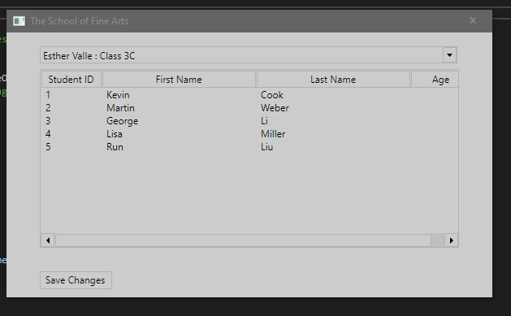

1. Sergio de Vega
2. 16 octubre 2020
3. Descripción Ejercicio **(20483C_MOD01_LAK.md)**:
   1. Ejercicio 1: Hemos implementado funcionalidad para editar la lista de estudiantes.
      1. Hemos introducido código para detectar cuando el usuario presiona Enter sobre una línea de estudiante seleccionada.
      
      2. Inicializamos el formulario de estudiante con los datos de la línea seleccionada.
      3. Después de realizar cambios en el formulario de estudiante, guardamos los cambios de vuelta al objeto Student.
      
      4. Verificamos.
      5. Utlizamos el Debugger para hacer modificaciones manualmente, mediante las ventanas WATCH e IMMEDIATE WINDOW, visualizando y cambiando el contenido del formulario de estudiantes.
      