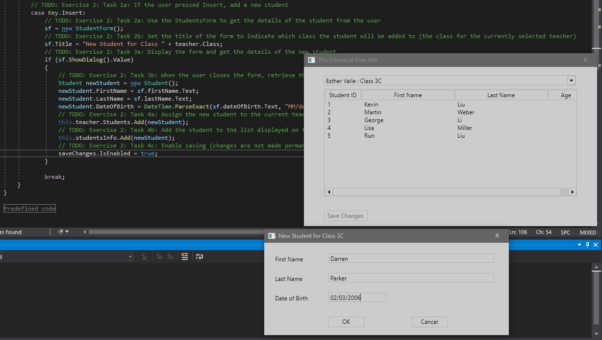

1. Sergio de Vega
2. 16 octubre 2020
3. Descripción Ejercicio **(20483C_MOD01_LAK.md)**:
   1. Ejercicio 2: Hemos implementado funcionalidad para editar la lista de estudiantes.
      1. Escribimos otro case dentro del código del formulario de estudiante,para detectar cuando el usuario presione "insertar" un nuevo estudiante.
      2. Inicializamos el formulario de estudiante.
      3. Mostramos el formulario para habilitar la entrada de datos.
      4. Escribimos el código para asignar el nuevo estudiante a una clase y permitir guardar.
      5. Ejecutamos y verificamos.  
      