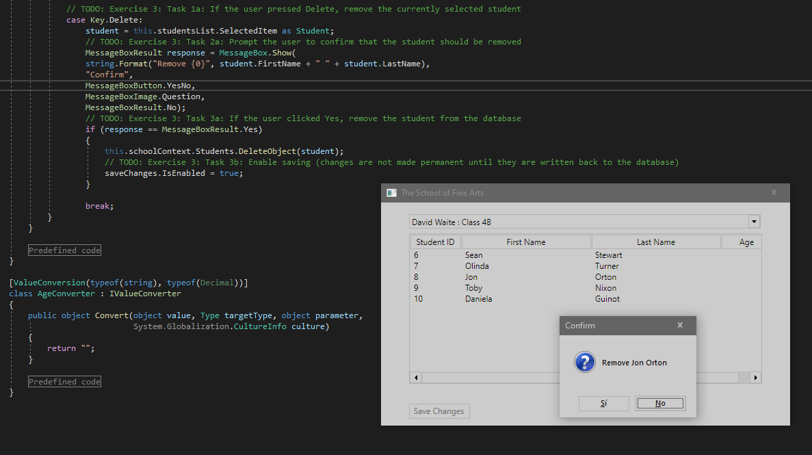

1. Sergio de Vega
2. 21 octubre 2020
3. Ejercicio 3 **(20483C_MOD01_LAK.md)**:
   1. Escribimos otro case dentro del código del formulario de estudiante,para detectar cuando el usuario presione "delete" para borrar un estudiante.
   2. Implementamos una confirmación de borrado.
   3. Escribimos el código para eliminar el registro del estudiante y permitir guardar.
   4. Ejecutamos y verificamos.  