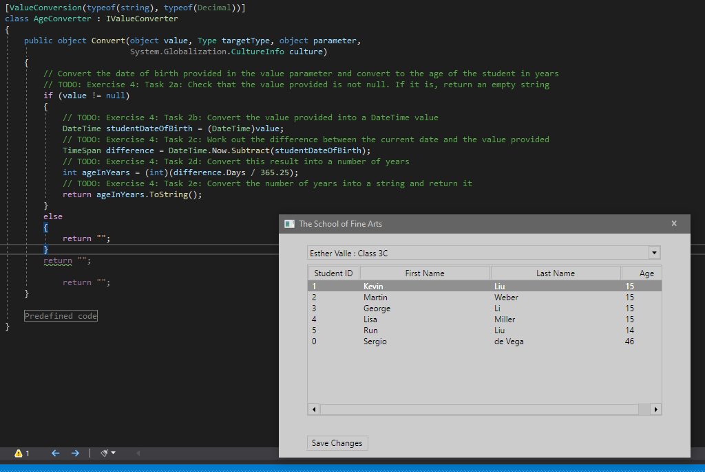

1. Sergio de Vega
2. 21 octubre 2020
3. Ejercicio 4 **(20483C_MOD01_LAK.md)**:
   1. Examinamos la ventana principal MainWindow XAML.
   2. Añadimos la lógica a la clase AgeConverter para calcular la edad de un alumno a partir de su fecha de nacimiento.
   4. Ejecutamos y verificamos.  