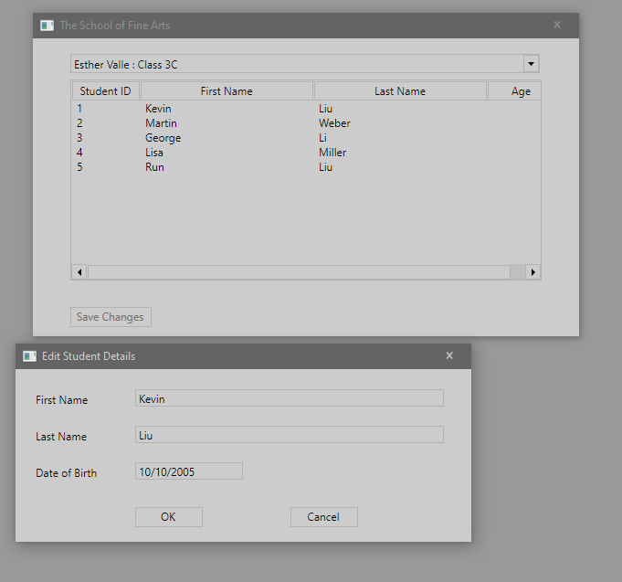

1. Sergio de Vega
2. 16 octubre 2020
3. Descripción:
   1. Ejercicio 1: Hemos implementado funcionalidad para editar la lista de estudiantes.
      1. Hemos introducido código para detectar cuando el usuario presiona Enter sobre una línea de estudiante seleccionada.
      
      2. Inicializamos el formulario de estudiante con los datos de la línea seleccionada.
      3. 
<<<<<<< HEAD
4. Dificultades:
=======
4. Dificultades:
>>>>>>> d5788625661db57976b0061986f9311bff5a0325
