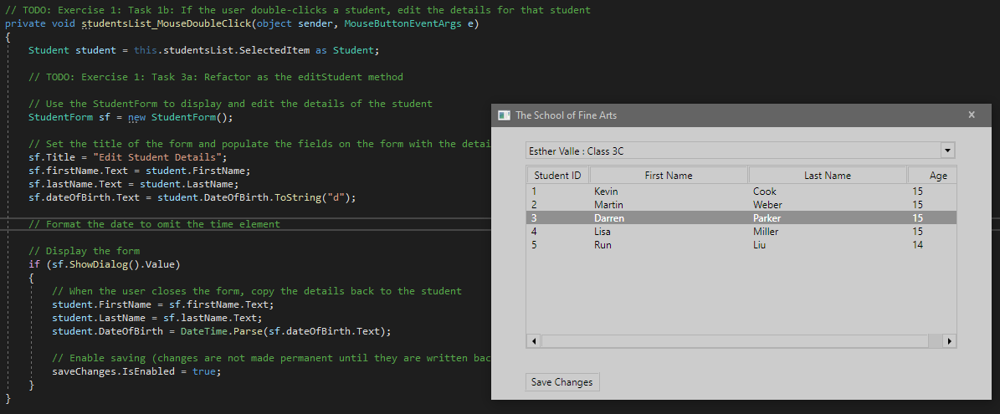
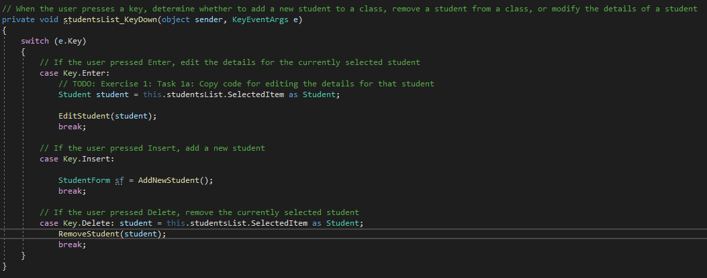
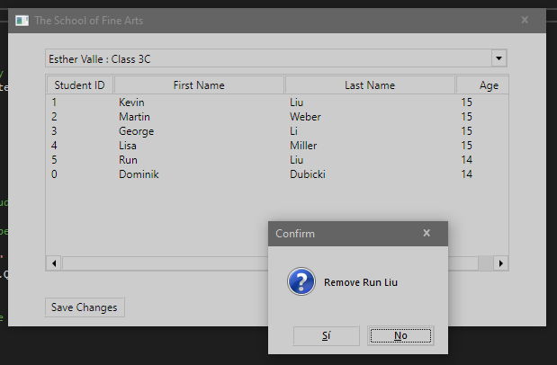
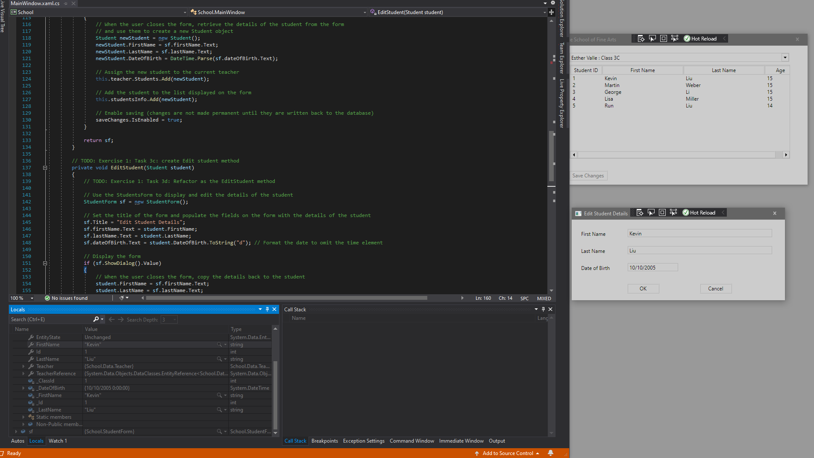

1. Sergio de Vega
2. 21 octubre 2020
3. Ejercicio 1 **(20483C_MOD02_LAK.md)**:
   1. Implementamos el código para editar un alumno de la lista mediante un doble-click, introduciendo el código correspondiente en el método studenList_MousedoubleClick.
   2. Ejecutamos la aplicación y verificamos que se puede editar un alumno de la lista mediante el doble-click.
   
   3. Refactorizamos el código de los métodos que añaden, borran y editan estudiantes.
   
   4. Ejecutamos y verificamos que todo funciona.
   
   5. Usamos el debugger y recorremos las llamadas a los nuevos métodos.
   