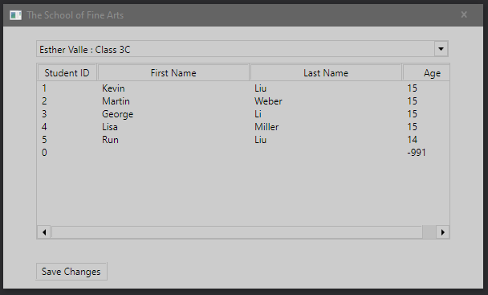
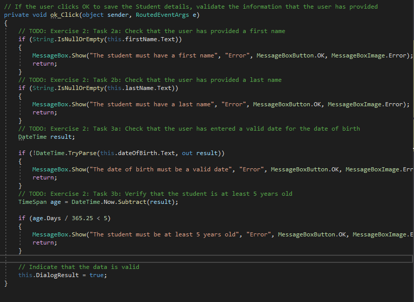
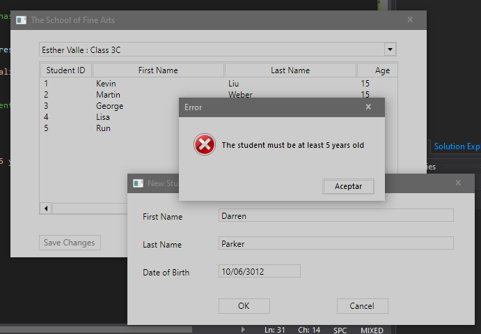

1. Sergio de Vega
2. 21 octubre 2020
3. Ejercicio 2 **(20483C_MOD02_LAK.md)**:
   1. Ejecutamos la aplicación y vemos que se pueden meter valores inválidos en los detalles de los estudiantes.
   
   2. Añadimos código para validar el nombre y apellido.
   3. Añadimos código para validar la fecha de nacimiento.
   
   4. Ejecutamos y verificamos.
   