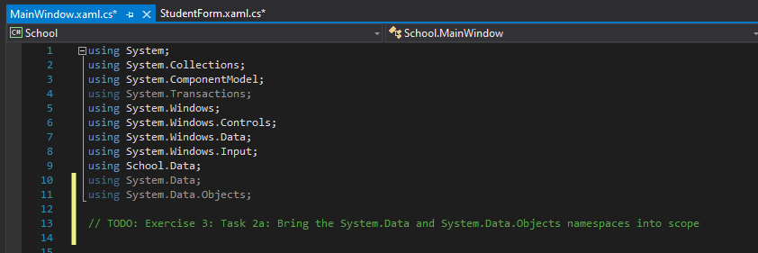
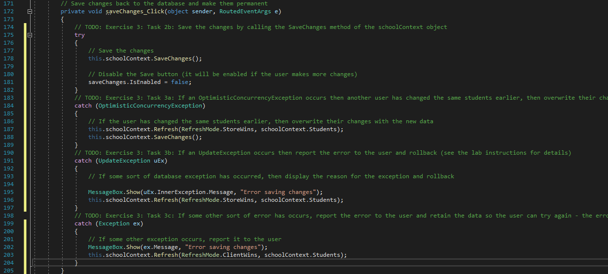
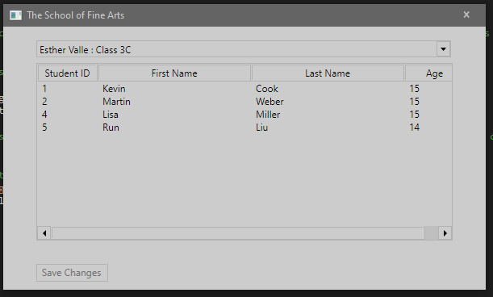

1. Sergio de Vega
2. 21 octubre 2020
3. Ejercicio 3 **(20483C_MOD02_LAK.md)**:
   1. Ejecutamos la aplicación y vemos que los cambios no se almacenan en la base de datos. Después de hacer cambios y cerrar la aplicación, al volver a abrirla, aparecen los mismos datos que al principio.
   2. Añadimos código para guardar los cambios en la base de datos.
   
   3. Añadimnos un try catch para controlar los errores típicos de bases de datos.
   
   4. Ejecutamos la aplicación y vemos que ahora sí se guardan los cambios en la base de datos.
   