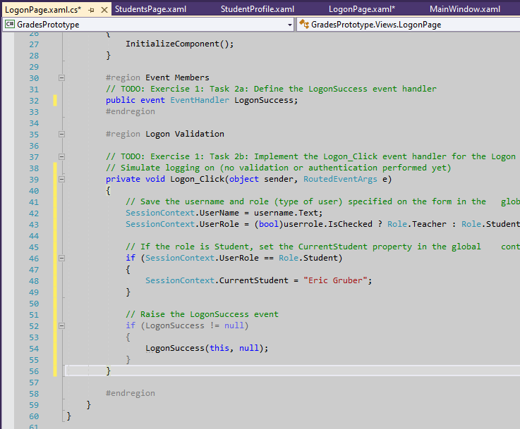
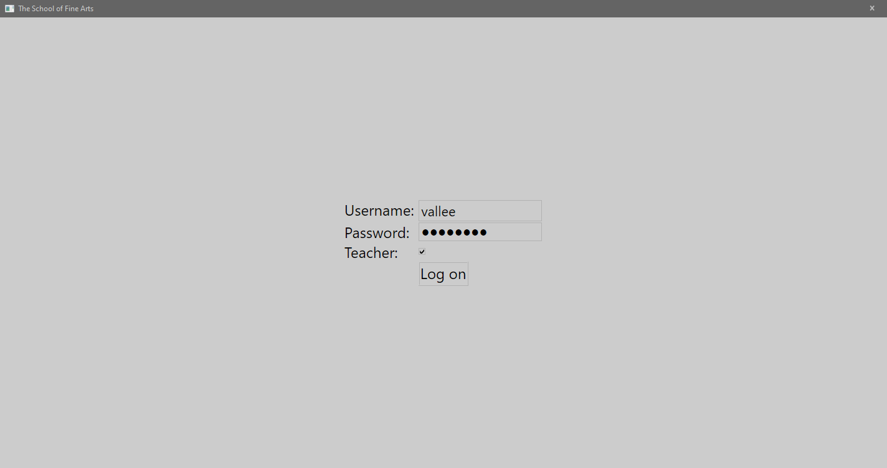
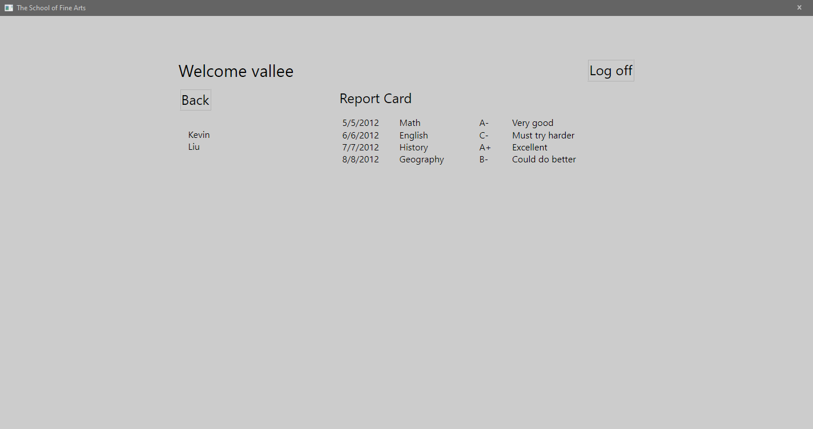
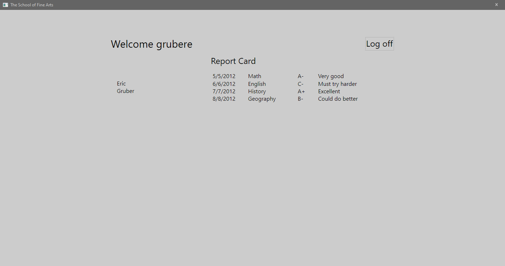

1. Sergio de Vega
2. 22 octubre 2020
3. **(20483C_MOD03_LAK.md)**:
   1. Ejercicio 01: Añadir lógica de navegación a la aplicación.
      1. Examinamos las ventanas y vistas de la aplicación y luego definimos el evento LogonSuccess y añadimos código al evento Logon_Click.
      
      2. Añadimos el código para mostrar la vista de Log on, y para determinar el tipo de usuario.
      3. Escribimos la lógica para manejar el evento Student_Click
      4. Ejecutamos y validamos la aplicación.
      
      
      
   2. Ejercicio 02: Crear Data Types para almacenar información.