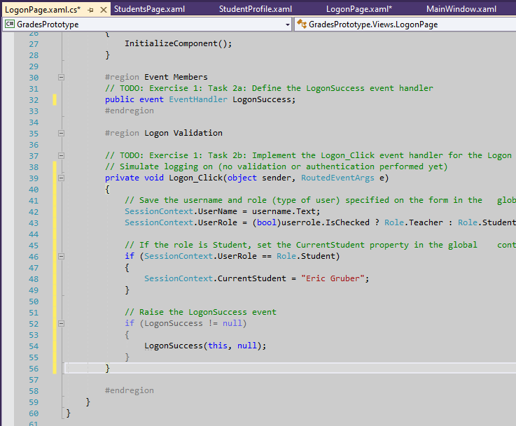
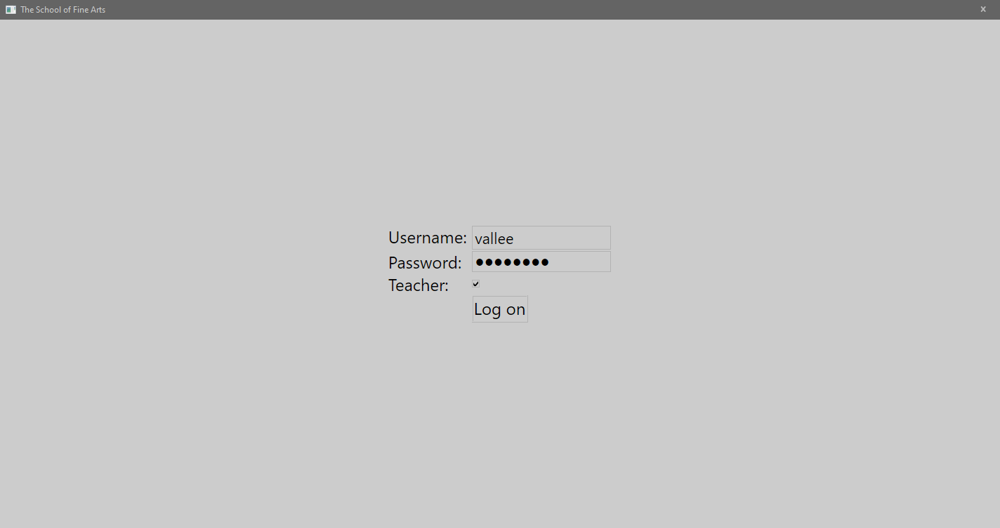
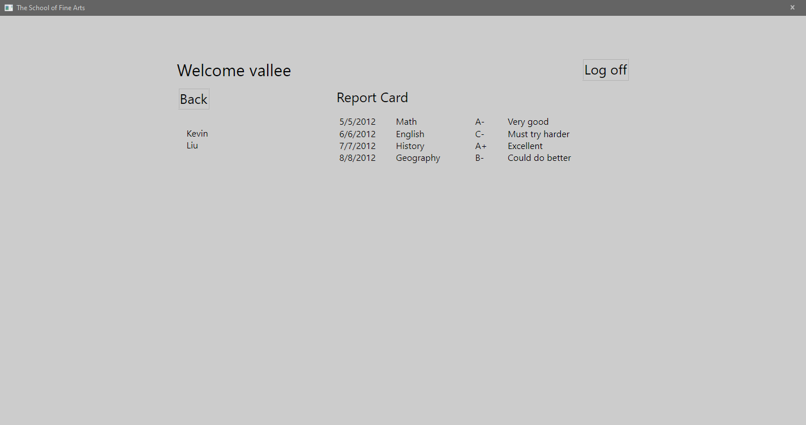
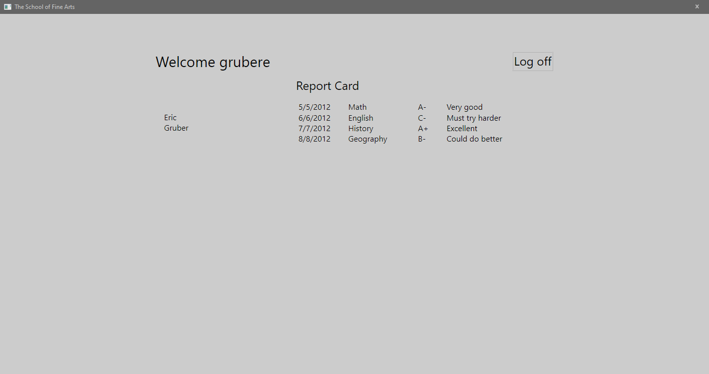
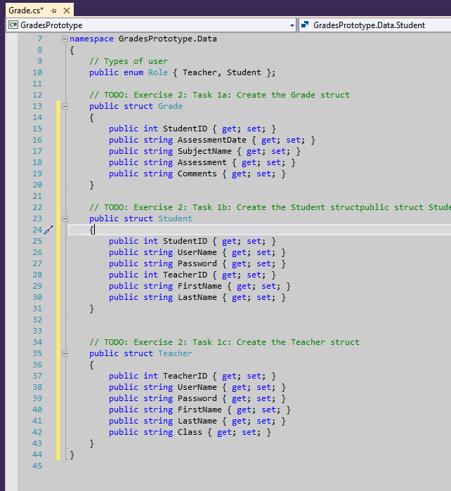
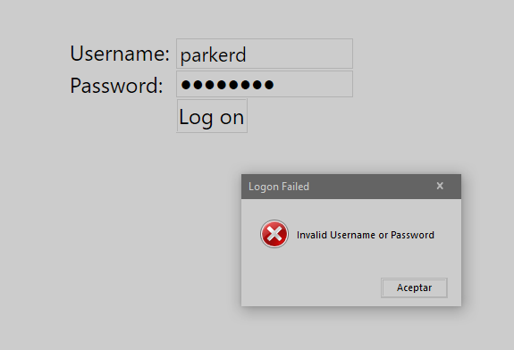
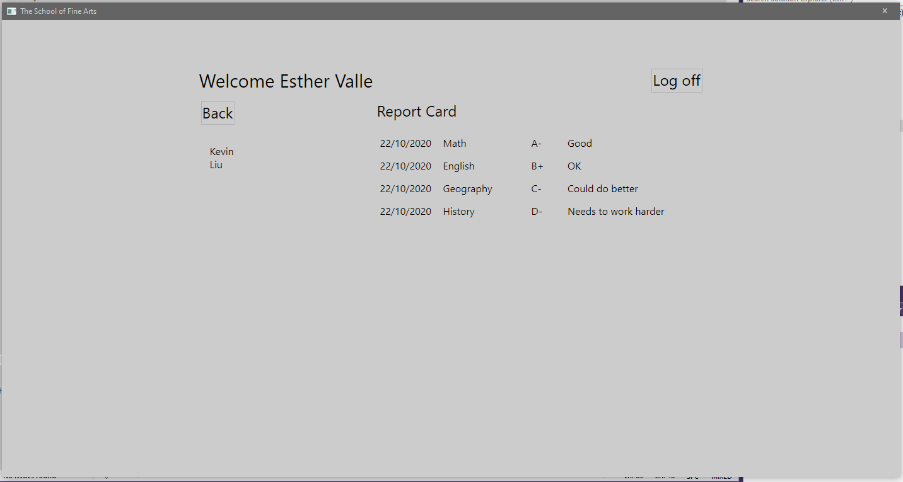

1. Sergio de Vega
2. 22 octubre 2020
3. **(20483C_MOD03_LAK.md)**:
   1. **Ejercicio 01:** Añadir lógica de navegación a la aplicación.
      1. Examinamos las ventanas y vistas de la aplicación y luego definimos el evento LogonSuccess y añadimos código al evento Logon_Click.
      
      2. Añadimos el código para mostrar la vista de Log on, y para determinar el tipo de usuario.
      3. Escribimos la lógica para manejar el evento Student_Click
      4. Ejecutamos y validamos la aplicación.
      
      
      
      ---
   2. **Ejercicio 02:** Crear Data Types para almacenar información.
      1. Definimos las estructuras para albergar la información de notas, estudiantes y profesores.
      
      2. Vemos cómo están creados los datos en la función CreateData en DataSource.cs
      ---
   3. **Ejercicio 03:** Mostrando la información de Usuario y Curso.
      1. Añadimos el evento LogonFailed y su manejador.
      2. Añadimos código para mostrar los estudiantes del profesor actual.
      3. Establecemos el DataContext para la página y ejecutamos y probamos.
      
      