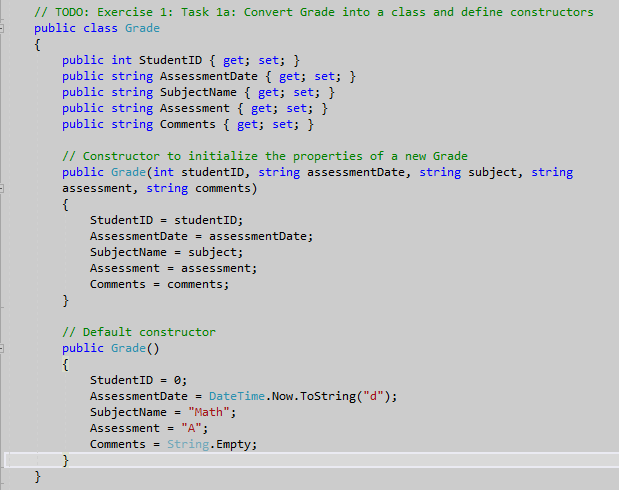
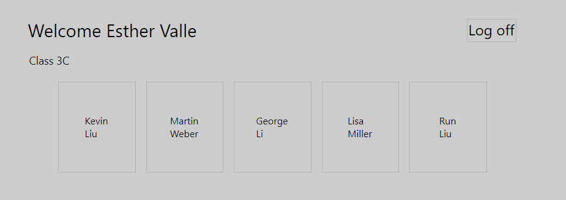
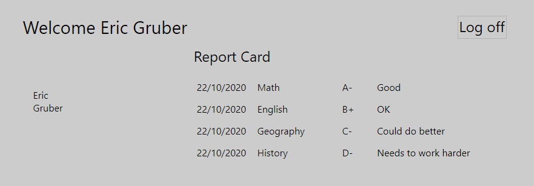
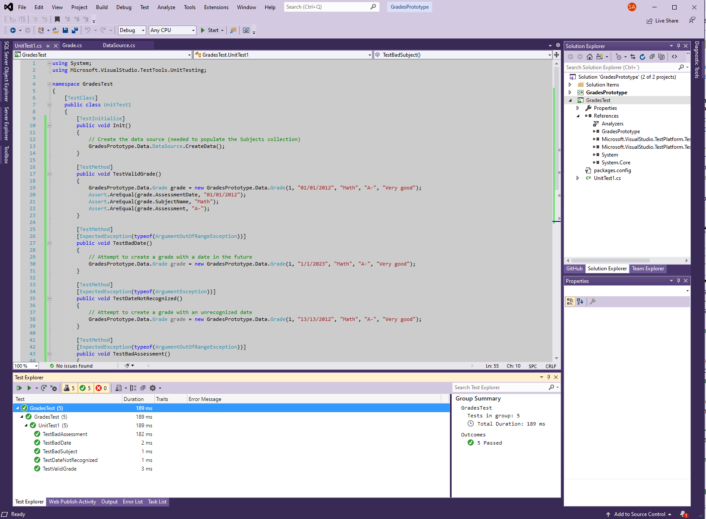
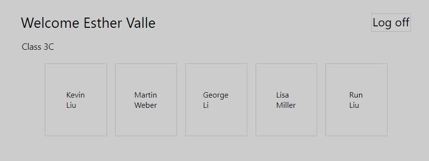
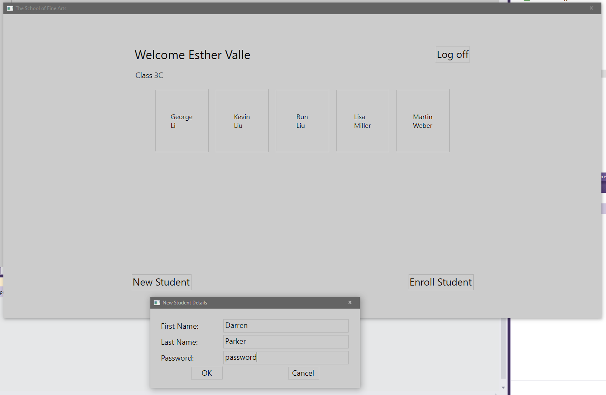
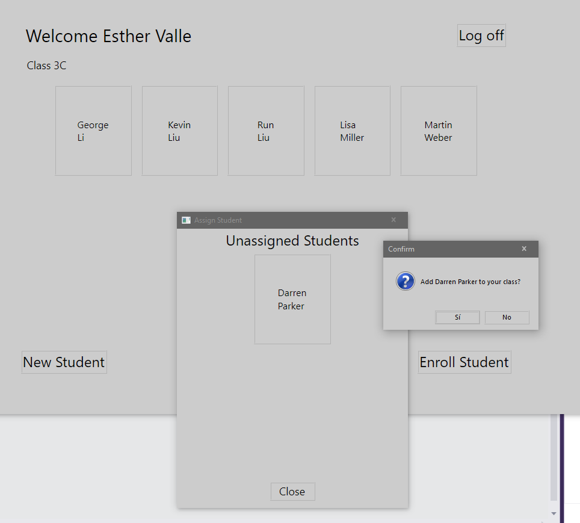
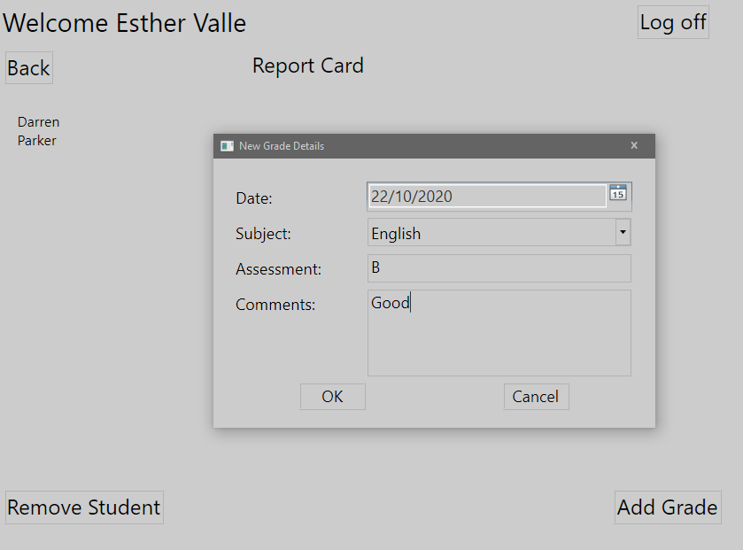

1. Sergio de Vega
2. 22 octubre 2020
3. **(20483C_MOD04_LAK.md)**:
   1. **Ejercicio 01:** Implementando estructuras como clases.
      1. Cambiamos el struct de Grade por class.
      
      2. Hacemos lo mismo con los struct de Students y Teachers.
      3. Implementamos el método VerifyPassword para validar la password del usuario en el login.
      4. Ejecutar y verificar la aplicación.
      
      
      ---
   2. **Ejercicio 02:** Añadir validación de datos a la clase Grade.
      1. Creamos una lista de nombres de materias.
      2. Añadimos lógica de validación a la clase Grade.
      3. Añadimos un Unit Test para verificar que las validaciones definidas por la clase Grade funcionan como se espera.
      
      ---
   3. **Ejercicio 03:** Mostrando los estudiantes por orden de Nombre.
      1. Ejecutamos y comprobamos que los estudiantes no se muestran ordenados cuando un profesor se logea.
      
      2. Implementamos la interface Icomparable<Student>
      3. Cambiamos el Students ArrayList por una lista genérica List<Student>
      4. Ordenamos los datos en la colección Students.
      5. Ejecutamos y verificamos que ahora sí se muestran los alumnos ordenados por apellido.
      
      ---
   4. **Ejercicio 04:** Permitiendo a los profesores modificar los datos de la clase y las notas.
      1. Cambiamos las colecciones (arraylists) de Teachers y Grades por listas genéricas.
      2. Añadimos los métodos EnrollInClass and RemoveFromClass a la clase Teacher.
      3. Añadimos el código necesario para añadir a un estudiante a un aula.
      4. Idem para eliminar a un alumno.
      5. Idem para permitir a un profesor calificar a un alumno.
      6. Ejecutamos y verificamos.
      
      
      
   