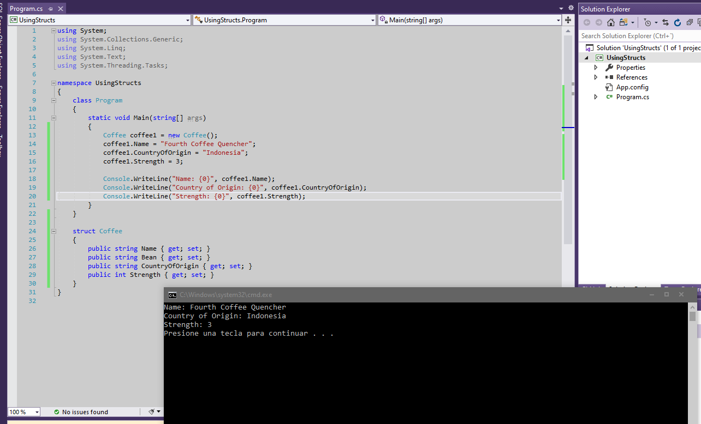
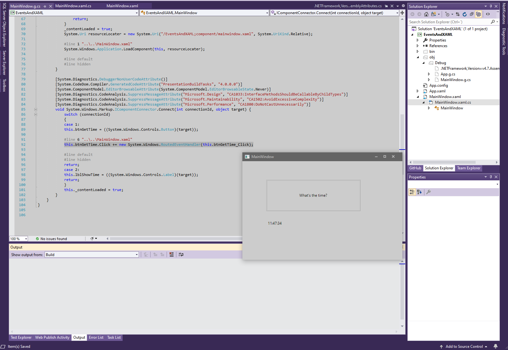

1. Sergio de Vega
2. 23 octubre 2020
3. **(20483C_MOD03_DEMO.md)**:
   1. Lección 01. Creamos y usamos una estructura.
   
   2. Lección 03. Manejando eventos. Hemos implementado el evento click para el botón "What´s the time?".
   
   