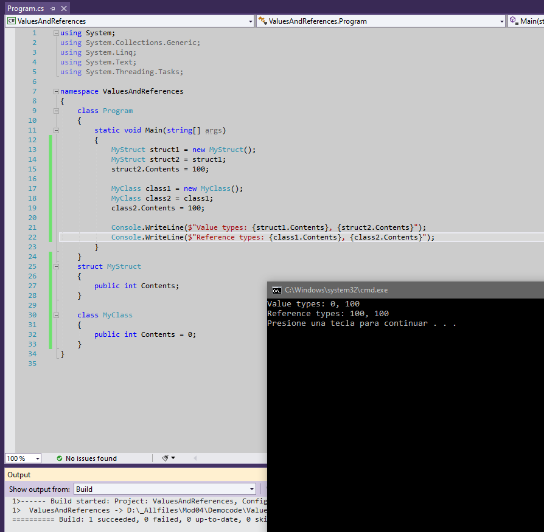

1. Sergio de Vega
2. 23 octubre 2020
3. **(20483C_MOD04_DEMO.md)**:
    1. Lección 1. Creando clases. Comparando tipos por referencia y por valor. En el ejemplo vemos cómo las estructuras son tipos por valor y las clases son tipos por referencia.
    