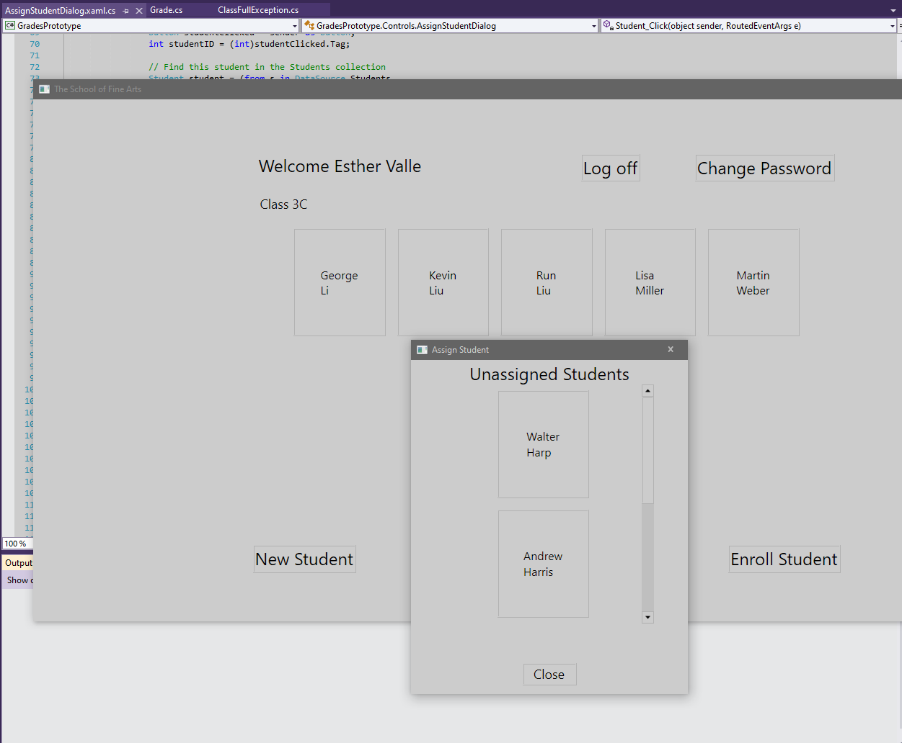

1. Sergio de Vega
2. 22 octubre 2020
3. **(20483C_MOD05_LAK.md)**:
   1. **Ejercicio 01:**
      1.  Creamos una clase base abstracta llamada User.
      
      2. Eliminamos propiedades y métodos de las clases Student y Teacher, ya que ahora las heredarán de User.
      3. Ejecutamos y verificamoes la funcionalidad.
      
      ---
   2. **Ejercicio 02:**
      1. Definimos el método abstracto SetPassword.
      2. Y lo implementamos en las clases Student y Teacher.
      3. Establecemos la password para un nuevo estudiante.
      4. Implementamos el cambio de password para un usuario existente.
      5. Ejecutamos y verificamos la nueva funcionalidad.
      
      
      ---
   3. **Ejercicio 03:**
      1. Implementamos la clase ClassFullException.
      2. Implementamos el throw y catch.
      3. Ejecutamos y verificamos.
      
      
      