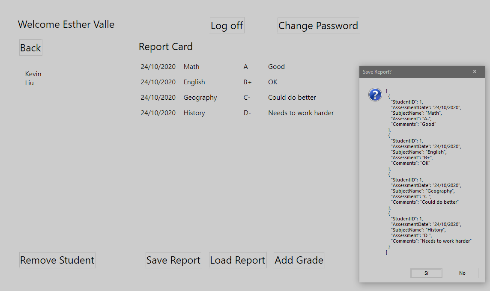
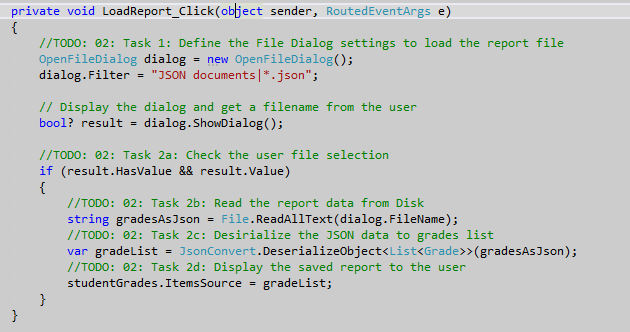

1. Sergio de Vega
2. 23 octubre 2020
3. **(20483C_MOD06_LAK.md)**:
   1. **Ejercicio 01:** Serializando datos como JSON.
      1. Preguntar al usuario por un nombre de archivo y devolver datos del curso.
      2. Serializar los datos del curso a un fichero stream.
      3. Grabamos el Json a disco.
      4. Ejecutamos y verificamos la funcionalidad del guardado.
      
      
   ---   
   1. **Ejercicio 02:** Deserializar datos desde el JSON al objeto Grades.
      1. Definir la configuración del diálogo del fichero para cargar el informe.
      2. Cargar el informe y mostrarlo al usuario.
      3. Ejecutar y verificar la funcionalidad.
      
      