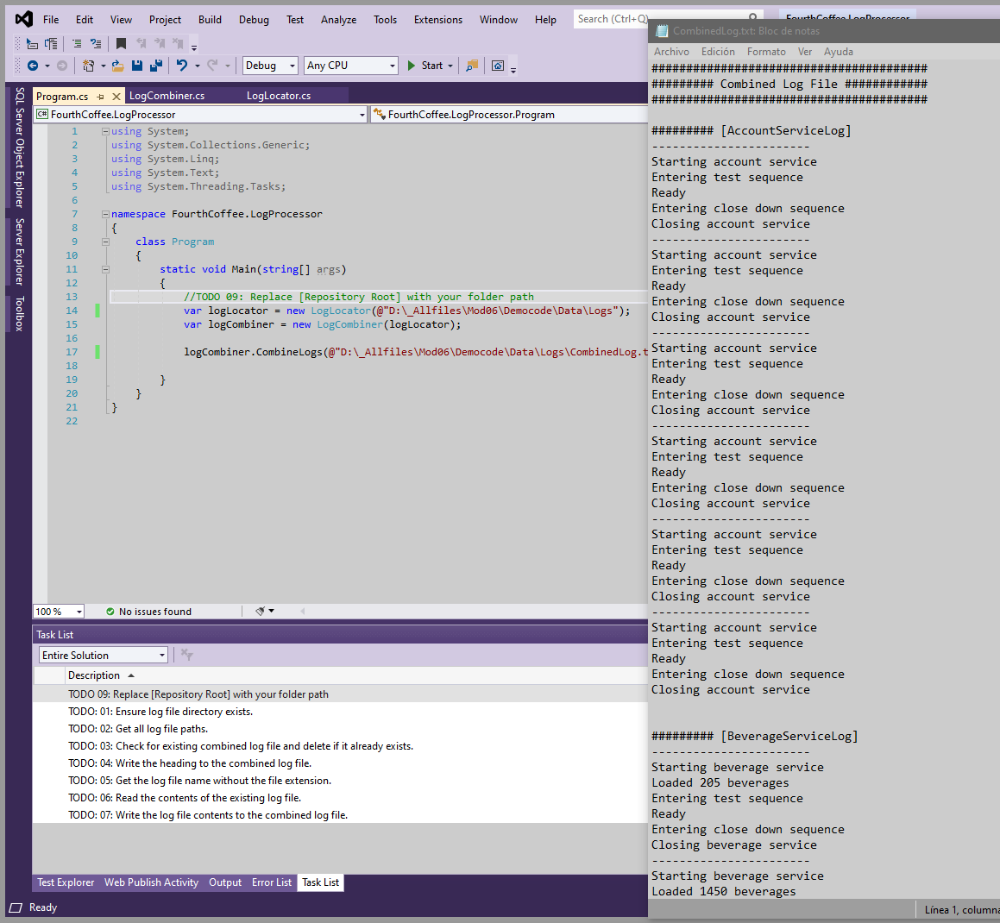
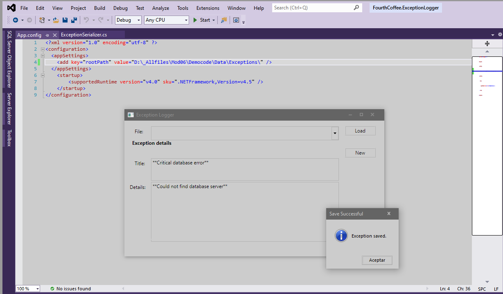
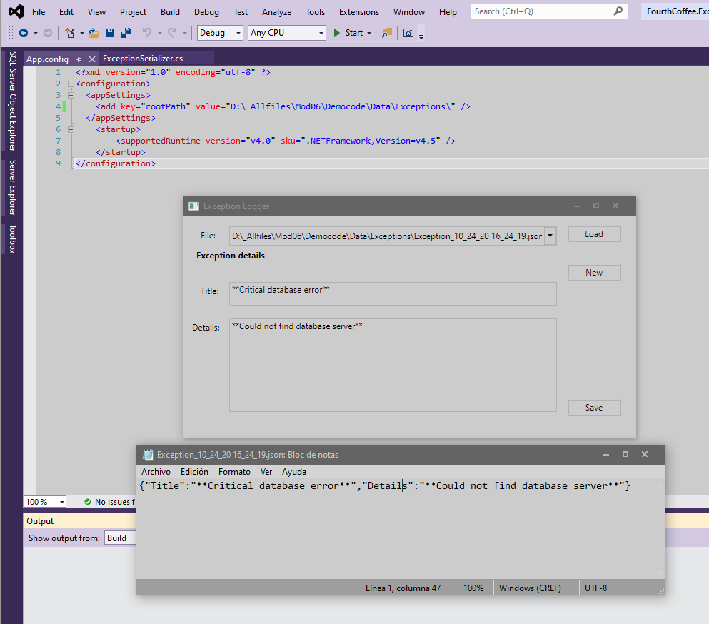

1. Sergio de Vega
2. 24 octubre 2020
3. **(20483C_MOD06_DEMO.md)**
   1. Lección 1: Leyendo y escribiendo datos locales.
      1. Manipulando archivos, directorios y rutas.
        
   2. Lección 2: Serializando y deserializando datos.
      1. Serializando objetos como JSON usando JSON.Net
      
      