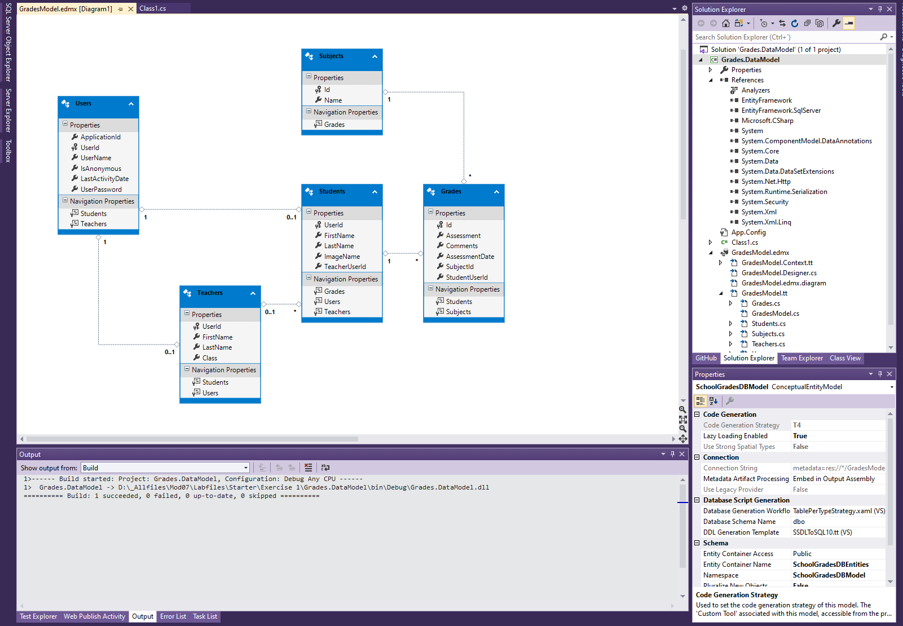
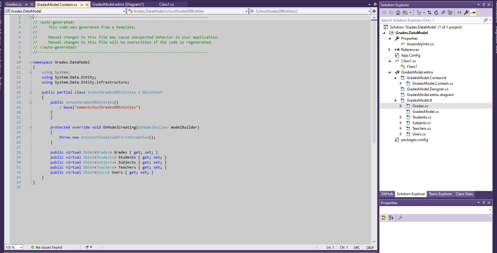
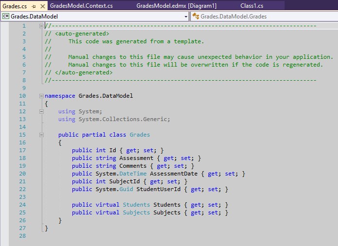
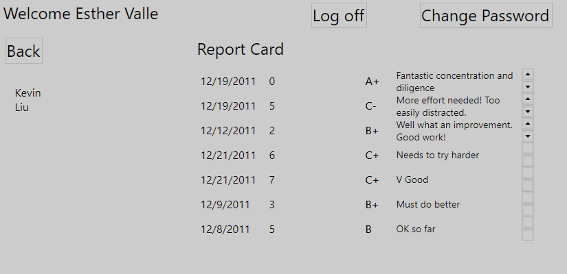
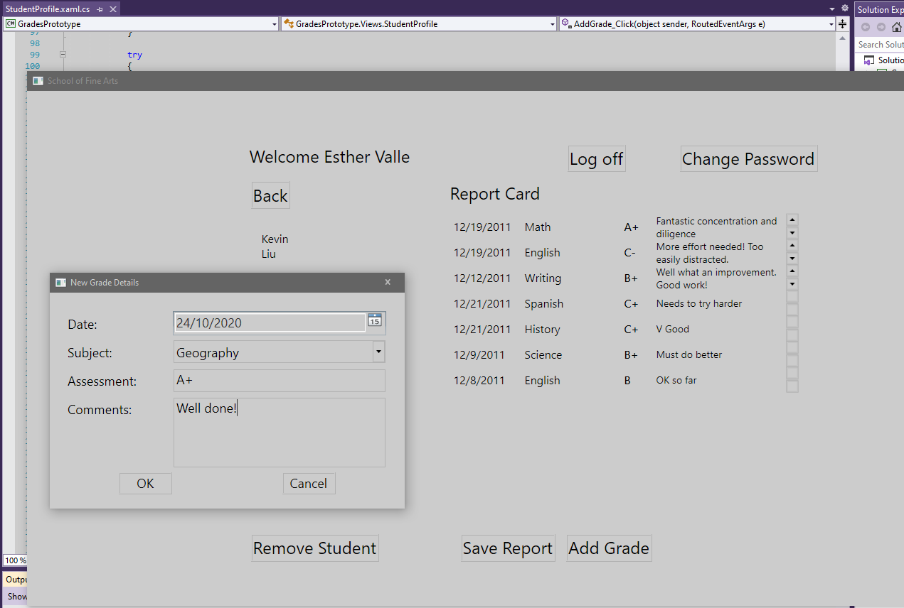
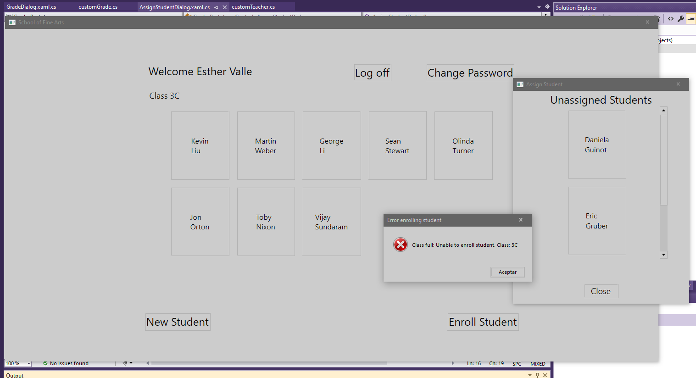
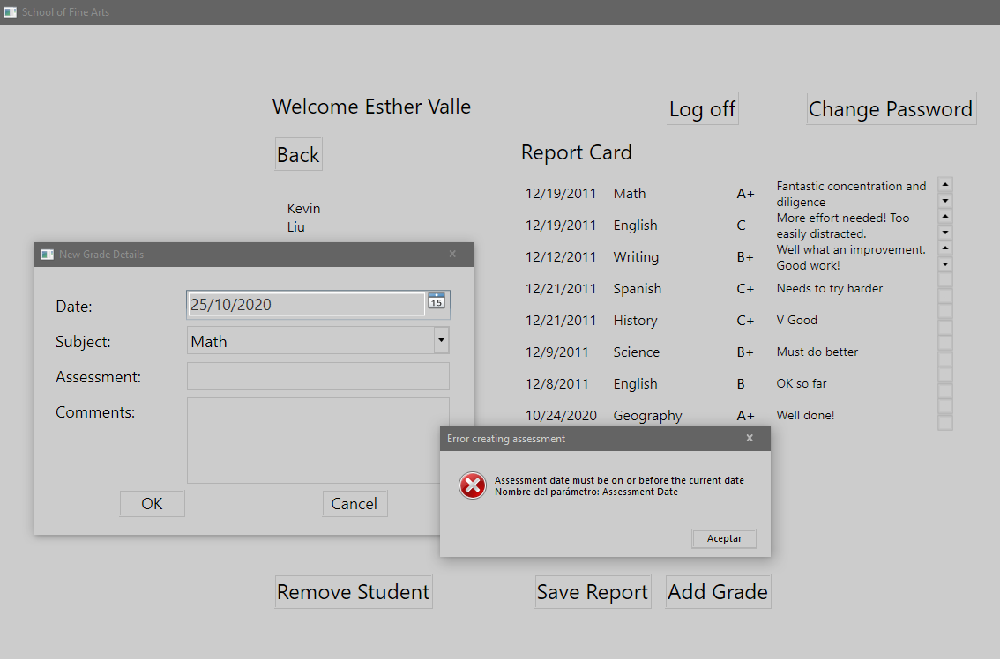
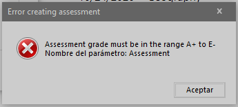

1. Sergio de Vega
2. 24 octubre 2020
3. **(20483C_MOD07_LAK.md)** Accediendo a una base de datos.
   1. **Ejercicio 01:** Creando un modelo de datos de Entidad desde la base de datos de The School of Fine Arts.
      1. Generar un Entity Data Model usando tablas de la base de datos SchoolGradesDB.
      
      2. Revisamos el código generado.
      
      
      ---
   2. **Ejercicio 02:** Actualizando datos del estudiante y calificaciones mediante el uso del Entity Framework.
      1. Mostrar las calificaciones para el actual estudiante.
      
      2. Mostrar el nombre de la tarea en la interfaz de usuario.
      3. Mostrar la vista de GradeDialog y usar la entrada para añadir una nueva calificación.
      4. Ejecutamos y verificamos.
      
      ---
   3. **Ejercicio 03:** Extendiendo el Modelo de Datos de Entidad para validar datos.
      1. Lanzanmos la excepción ClassFullException cuando intentamos dar de alta más alumnos de los permitidos.
      2. Añadimos la lógica de validación para las propiedades Assestment y AssesmentDate.
      3. Ejecutamos y validamos.
      
      
      

      