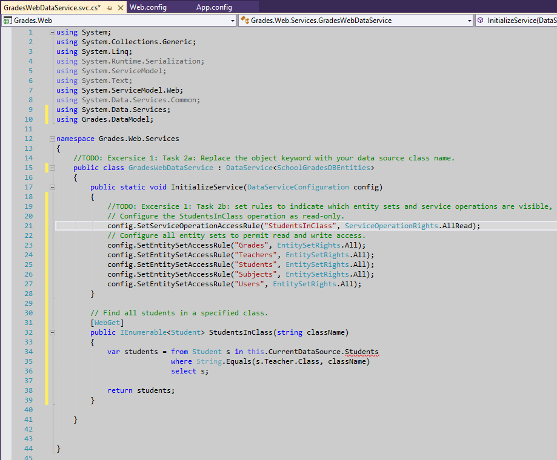
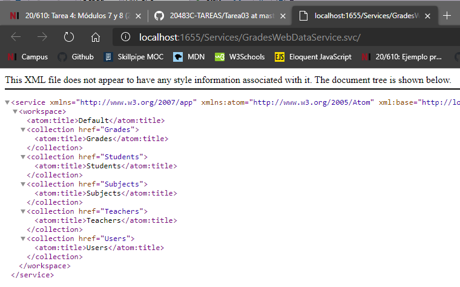
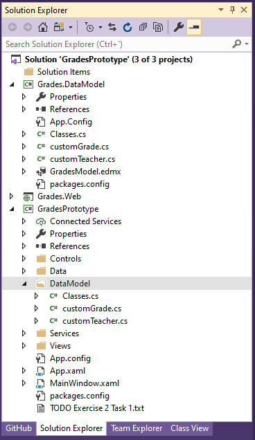
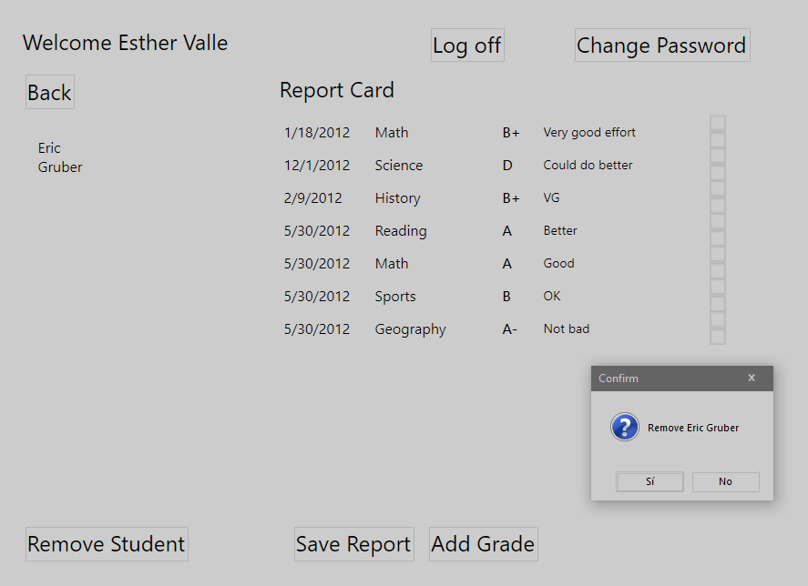
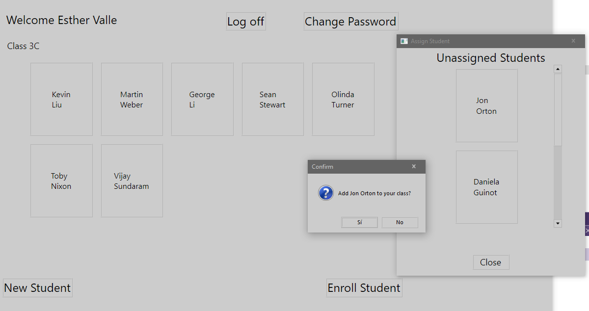
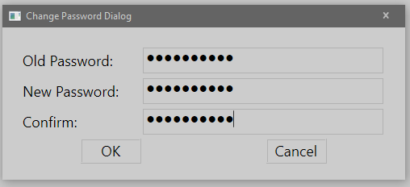
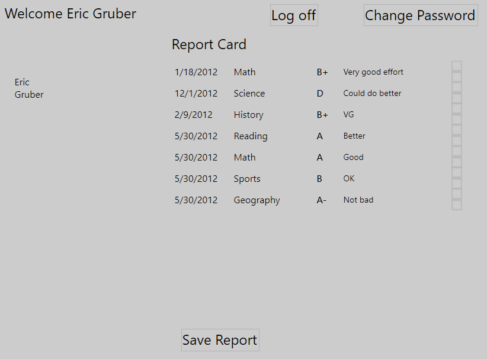
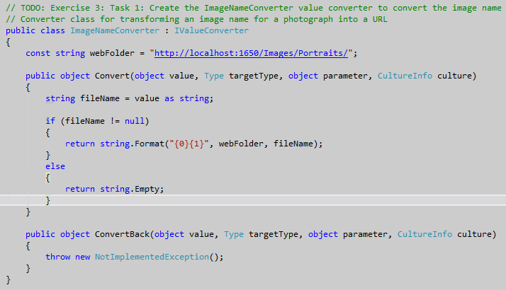
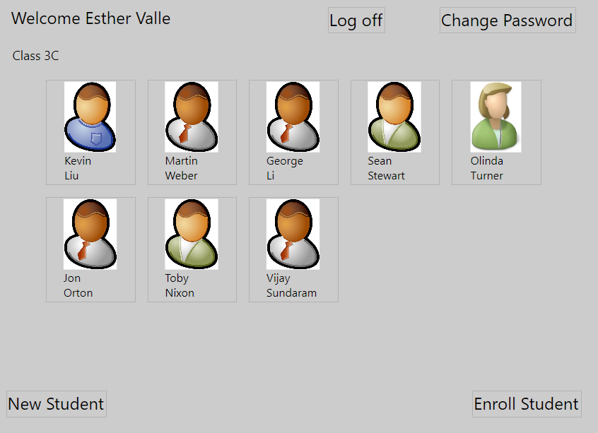
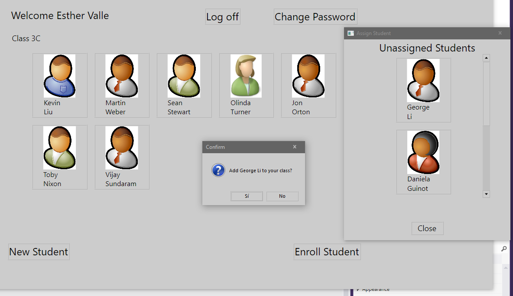

1. Sergio de Vega
2. 24 octubre 2020
3. **(20483C_MOD08_LAK.md)**:
   1. **Ejercicio 01:** Creando un WCF Data Service para la base de datos SchoolGrades.
      1. Configuramos el data service en el proyecto Grades.Web.
      2. Especificar el contexto de datos de GradesDBEntities para el Data Service.
      3. Añadir una operación para recuperar todos los estudiantes en una clase.
      
      4. Ejecutamos y verificamos.
      
      ---
   2. **Ejercicio 02:** Integrando el Data Service en la aplicación.
      1. Añadir a la aplicación GradesPrototype un OData Connected Service para el WCF Data Service.
      
      2. Modificamos el código que accede al Entity Data Model para usar el WCF Data Service.
      3. Modificamos el código que guarda los cambios de vuelta a la base de datos para usar el WCF Data Service.
      4. Ejecutamos y verificamos.
      
      
      
      
      ---
   3. **Ejercicio 03:** Recuperando las fotografías de los estudiantes desde la web.
      1. Creamos la clase convertidora de valor ImageNameConverter
      
      2. 3. 4. Añadimos un control Imagen a las vistas StudentsProfile y StudentsPage del proyecto GradesPrototype y lo asociamos a la propiedad ImageName. También lo hacemos con el control AssignStudentDialog.
      5. Ejecutamos y verificamos.
      
      