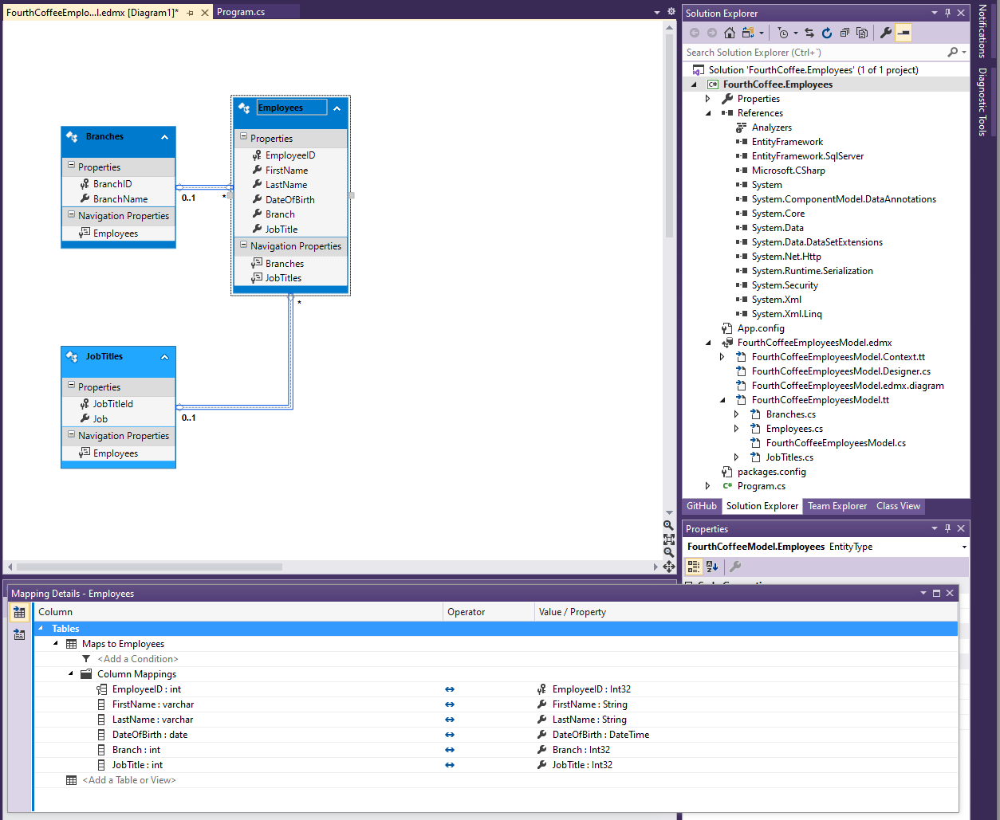
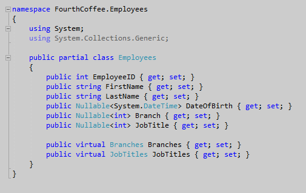
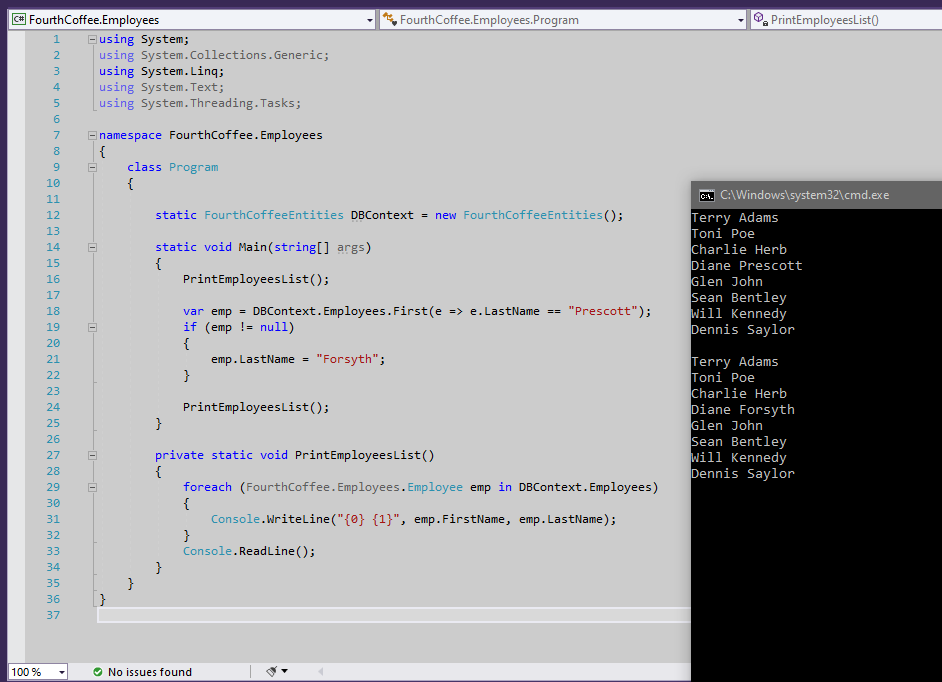
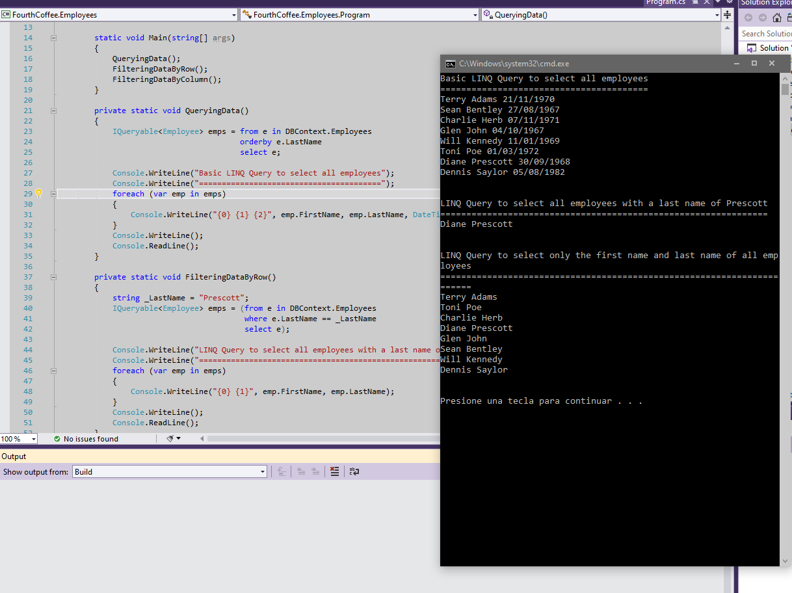
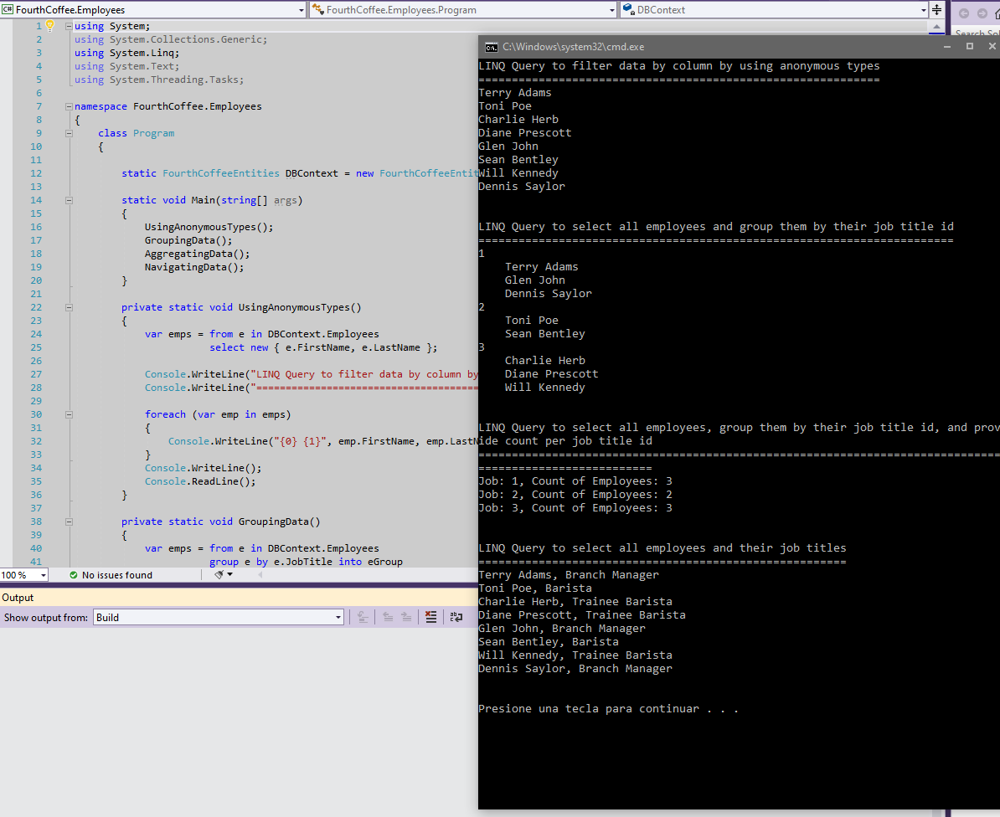

1. Sergio de Vega
2. 24 octubre 2020
3. **(20483C_MOD07_DEMO.md)** Accediendo a Base de datos.
   1. Lección 1: Creando y usando Entity Data Models.
      1. Demo1:Creando un EDM.
      
      
      2. Demo2: Leyendo y modificando datos en un EDM. Revisamos el código del programa y ejecutamos.
      
      ---
   2. Lección 2: Solicitando datos mediante el uso de LINQ.
      1. Demo1: Solicitando datos. Revisamos el código del programa y ejecutamos.
      
      2. Demo2: Solicitando datos usando tipos anónimos.
      