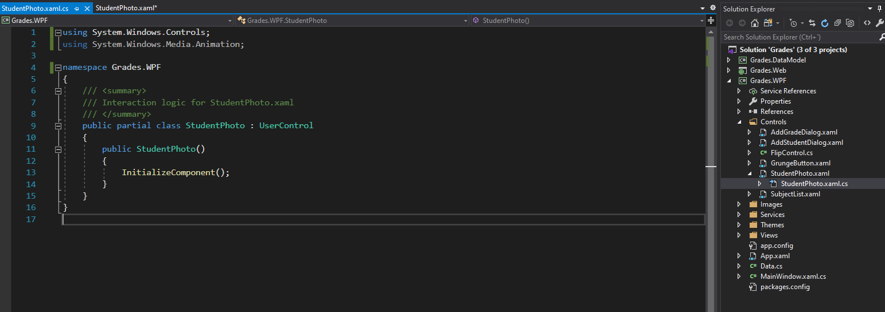
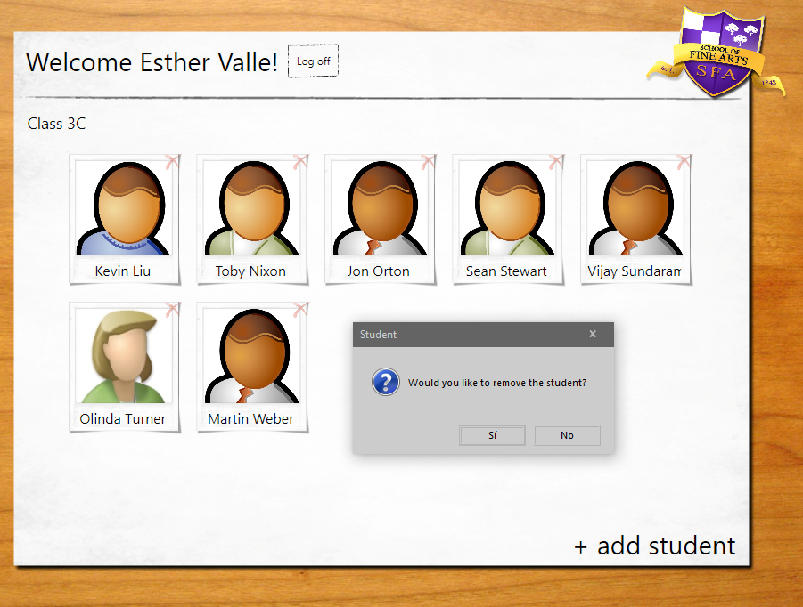
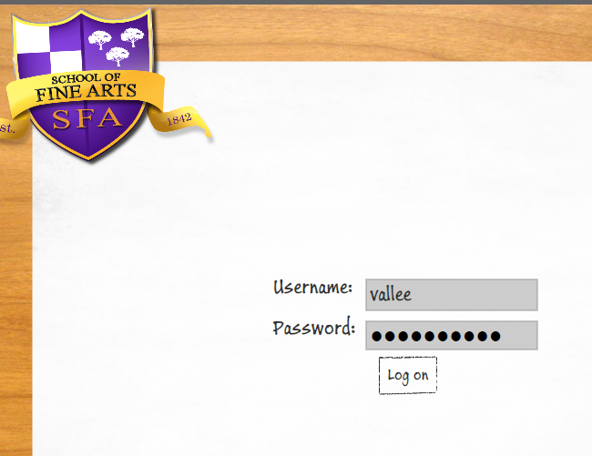
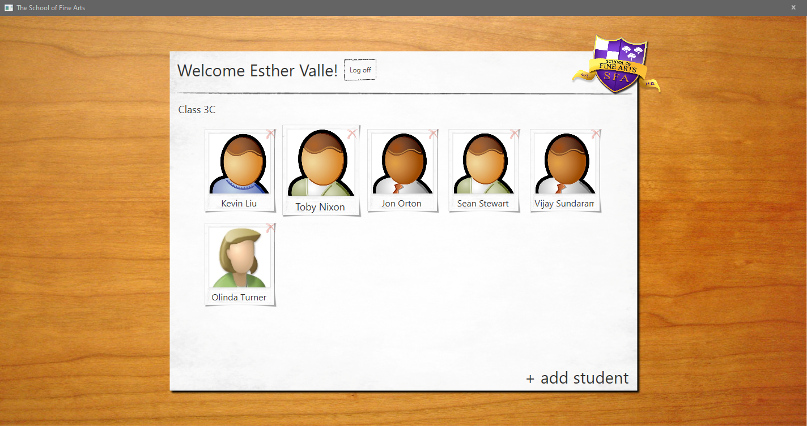

1. Sergio de Vega
2. 16 noviembre 2020
3. **(20483C_MOD09_LAK.md)** Diseñando la UI para una aplicación gráfica.
   1. **Ejercicio 01:** Personalizando la apariencia de las fotos de los estudiantes.
      1. Creamos el control de usuario de StudentPhoto.
      
      2. Mostrar las fotos de los estudiantes en la vista StudentsPage.
      3. Permitir al usuario mostrar los detalles de un estudiante.
      4. Añadir un botón Eliminar a la vista StudentsPage.
      5. Mostrar todos los estudiantes para el profesor actual.
      6. Ejecutar y verificar la aplicación.
      
      ---
   2. **Ejercicio 02:** Dando estilo a la vista Logon.
      1. Definir y aplicar estilos a la vista LogonPage
      2. Definir estilos globales para la aplicación.
      3. Ejecutar y verificar.
      
      ---
   1. **Ejercicio 03:** Animando el control de StudentPhoto.
      1. Definir animaciones para el control SudentPhoto.
      2. Añadir manejadores de eventos para disparar las animaciones.
      3. Ejecutar y verificar.
      

      