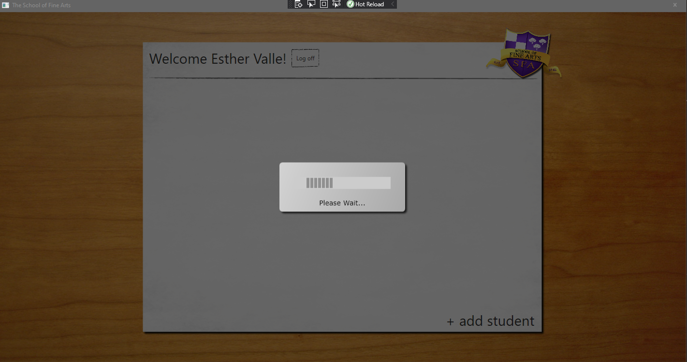

1. Sergio de Vega
2. 16 noviembre 2020
3. **(20483C_MOD10_LAK.md)** Mejorando el rendimiento y respuesta de la aplicación.
   1. **Ejercicio 01:** Asegurar que la UI permanece activa cuando se obtienen los datos del profesor.
      1. Ejecutamos y verificamos que la ventana de Logon se congela mientras muestra la lista de estudiantes para un profesor/clase.
      2. Modificar el código que obtiene los datos del profesor para ejecutarse asíncronamente.
      3. Convertir en asíncrono el código que obtiene y muestra la lista de estudiantes para un profesor.
      4. Ejecutar y verificar.
      ---
   2. **Ejercicio 02:** Proveyendo feedback visual durante operaciones que tardan en ejecutarse.
      1. Creando el control BusyIndicator (indicador de ocupado).
      
      2. Añadir lo métodos de manejadores de eventos para StartBusy y EndBusy.
      3. Levantar estos dos eventos.
      4. Ejecutar y verificar.
       

      