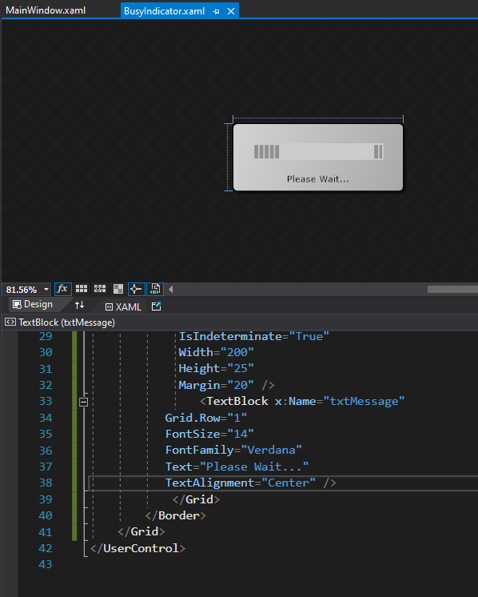

1. Sergio de Vega
2. xx octubre 2020
3. **(20483C_MOD10_LAK.md)** Mejorando el rendimiento y respuesta de la aplicación.
   1. **Ejercicio 01:** Asegurar que la UI permanece activa cuando se obtienen los datos del profesor.
      1. Ejecutamos y verificamos.
      
      ---
   2. **Ejercicio 02:** Proveyendo feedback visual durante operaciones que tardan en ejecutarse.

      