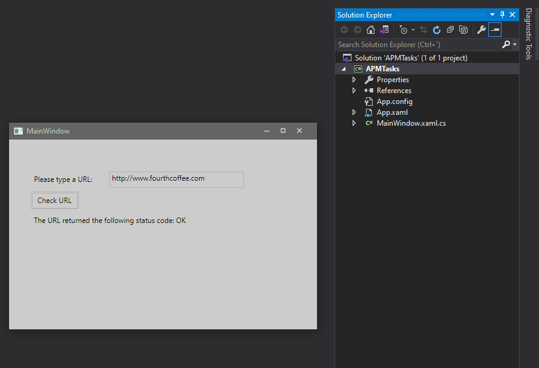

1. Sergio de Vega
2. xx octubre 2020
3. **(20483C_MOD10_DEMO.md)** 
   1. Lección 2: Realizando operaciones asíncronas.
      
   ---
   2. Lección 3: Sincronizando accesos concurrentes a datos.
      