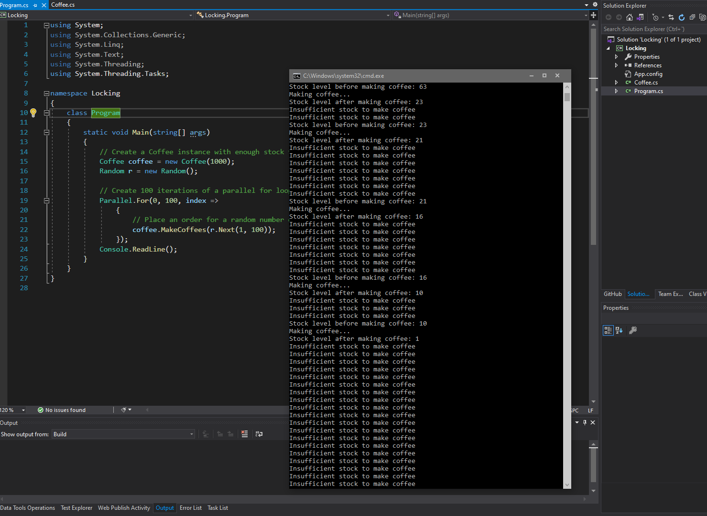

1. Sergio de Vega
2. 19 noviembre 2020
3. **(20483C_MOD10_DEMO.md)** 
   1. Lección 2: Realizando operaciones asíncronas.
      1. Ejecutamos y verificamos la funcionalidad.
      
      2. Sustituimos el método ResponseCallback por una operación APM usando la Task Parallel Library.
      3. Ejecutamos y comprobamos la funcionalidad.
      
   ---
   2. Lección 3: Sincronizando accesos concurrentes a datos.
      1. Usando sentencias Lock. Ejecutamos y verificamos.
      
      2. Comentamos la línea lock (coffeeLock) dentro de la clase Coffee.
      3. Ejecutamos y verificamos que da una excepción.
      

      