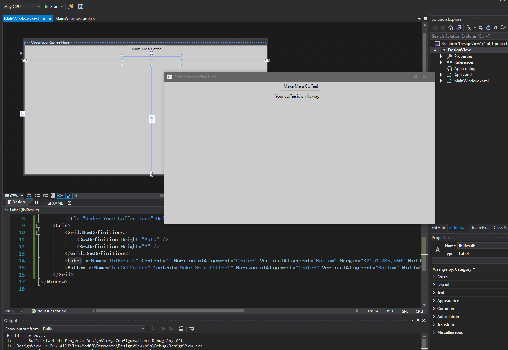

1. Sergio de Vega
2. 19 noviembre 2020
3. **(20483C_MOD09_DEMO.md)** 
   1. Lección 1: Usando XAML para diseñar una UI.
      1. Demo1: Usando Desing View para crear una UI XAML. Creamos un nuevo proyecto, añadimos al AXML un botón y una etiqueta para mostrar un mensaje cuando se haga click en el botón.
      
      