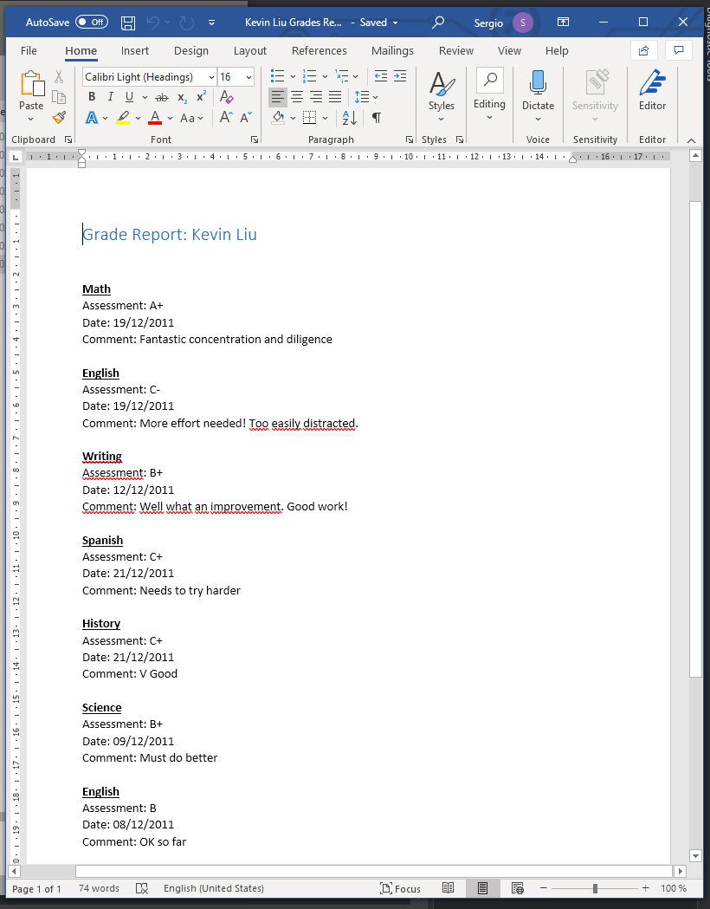

1. Sergio de Vega
2. 20 noviembre 2020
3. **(20483C_MOD11_LAK.md)** Interactuando con código no gestionado.
   1. **Ejercicio 01:** Generar el informe de Grades mediante Word.
      1. Examinar la clase WordWrapper que provee el envoltorio sobre el API dinámico para Word.
      2. Revisamos el código del método GeneratedStudentReport para generar un documento Word.
      3. Ejecutamos y verificamos.
      
      
      ---
   2. **Ejercicio 02:** Controlando el tiempo de vida de objetos Word utilizando el patrón Dispose.
      1. Ejecutar la aplicación para generar un informe y ver la tarea Word en el administrador de tareas.
      2. Actualizar la clase WordWrapper para que cierre Word correctamente.
      3. Envolver el objeto que genera el documento Word en una sentencia "using".
      4. Usar el administrador de tareas para comprobar que Word se cierra después de generar el informe.
      
      
      
 