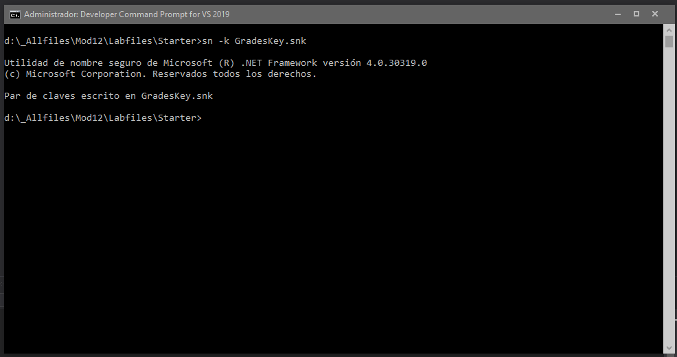

1. Sergio de Vega
2. 20 noviembre 2020
3. **(20483C_MOD12_LAK.md)** Creando tipos y ensamblados reutilizables.
   1. **Ejercicio 01:** Creando y utilizando el atributo IncludeInReport.
      1. Escribir el código para la clase IncludeInReportAttribute.
      
      2. Aplicar el atributo IncludeInReportAttribute a las propiedades.
      3. Compilar y revisar los metadatos para la clase LocalGrades.
      
      
      
      
      ---
   2. **Ejercicio 02:** Actualizando el informe.
      1. Implementar la clase de ayuda estática llamada IncludeProcessor.
      2. Actualizar la funcionalidad de la vista StudentProfile.
      3. Ejecutar y verificar.
      
      
   3. **Ejercicio 03:** Almacenando centralizadamente el ensamblado Grades.Utilities.
      1. Firmar el ensamblado e implementarlo en la GAC.
      
      
      
      2. Referenciar el ensamblado de la GAC desde la aplicación.
      
      
 