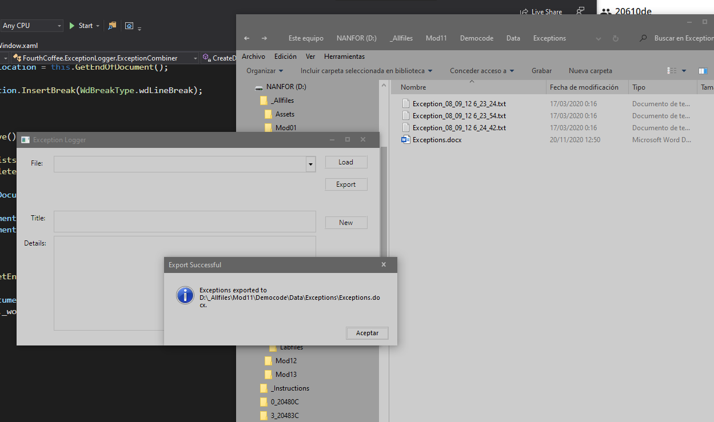
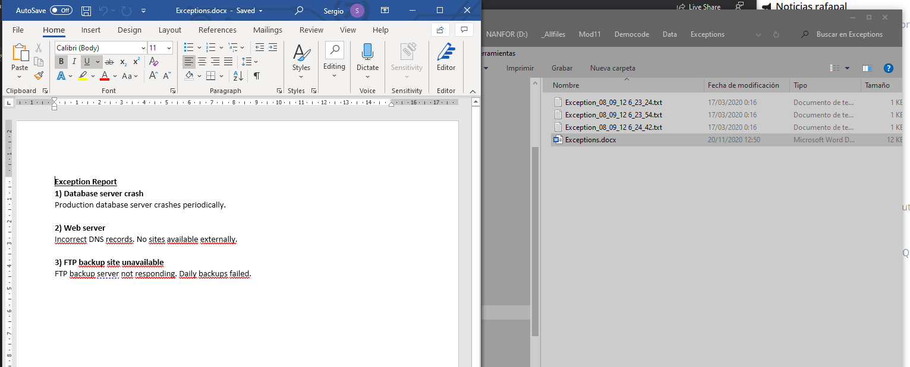

1. Sergio de Vega
2. 20 noviembre 2020
3. **(20483C_MOD11_DEMO.md)** Integración con código no gestionado. 
   1. Lección 1: Crear y usar objetos dinámicos. Interoperabilidad con Word.
   
   
      

      