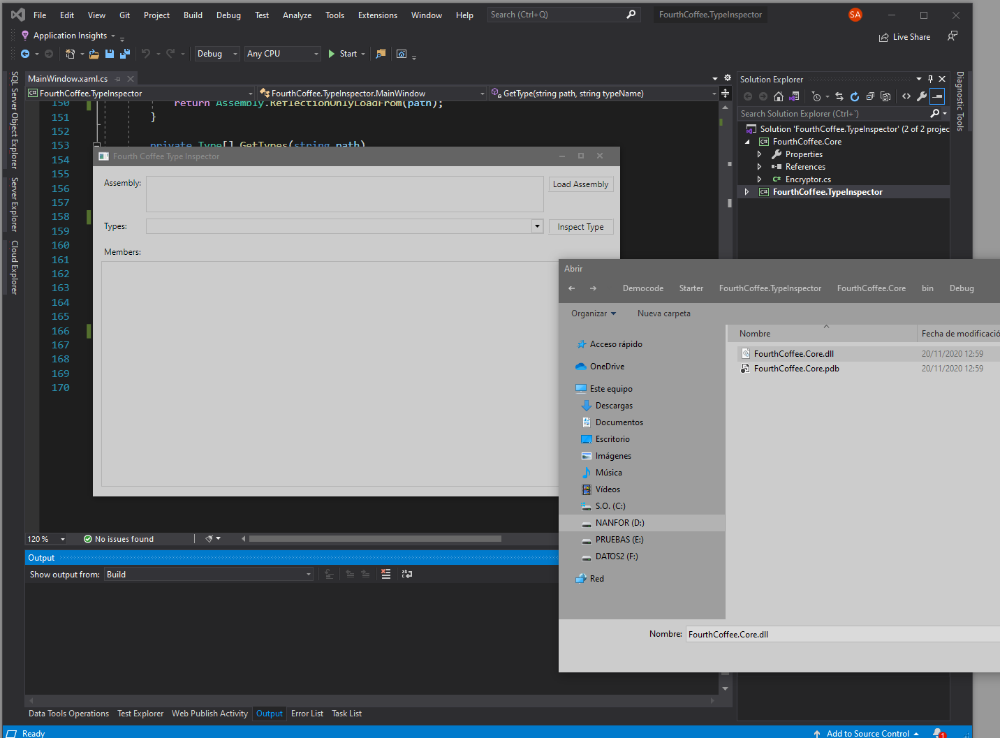
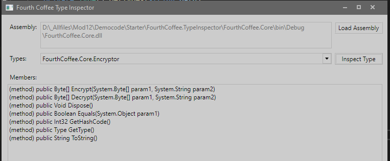
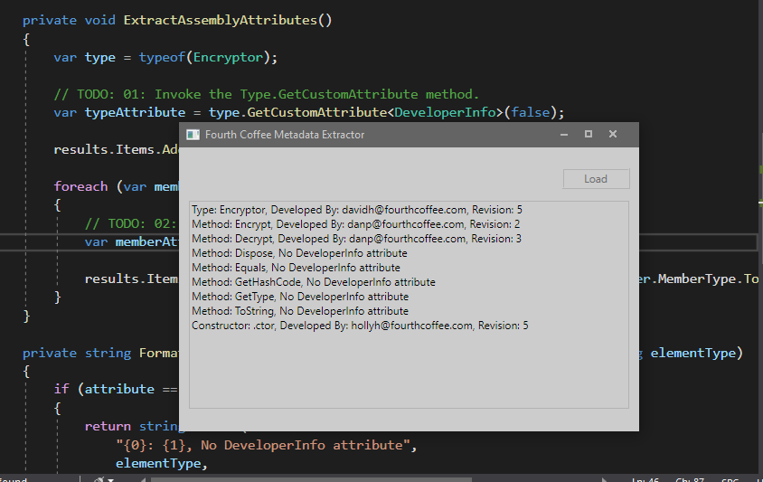
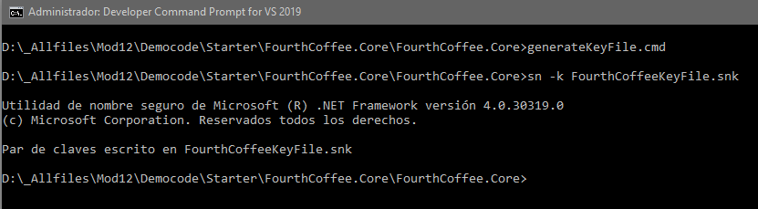
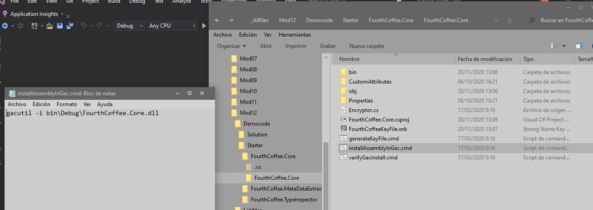
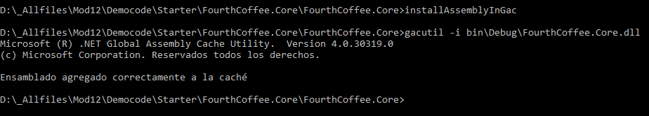
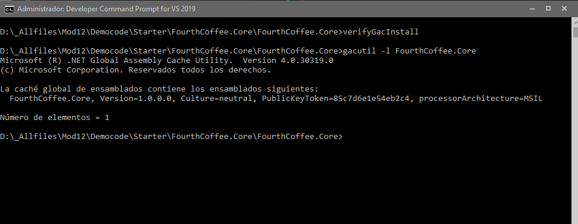

1. Sergio de Vega
2. 20 noviembre 2020
3. **(20483C_MOD12_DEMO.md)** Creando Tipos y Ensamblados reutilizables.
   1. Lección : Examinando metadatos de objetos.
   
   
   ---
   2. Lección 2: Crear y usar atributos personalizados.
   
   3. Lección 4: Versionear, firmar e implementar ensamblados.
   
      
   
   
      