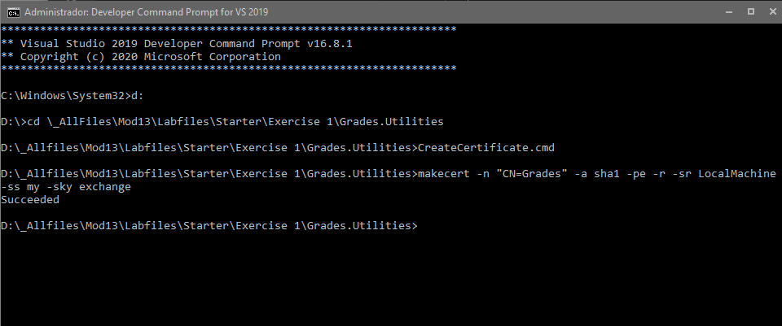
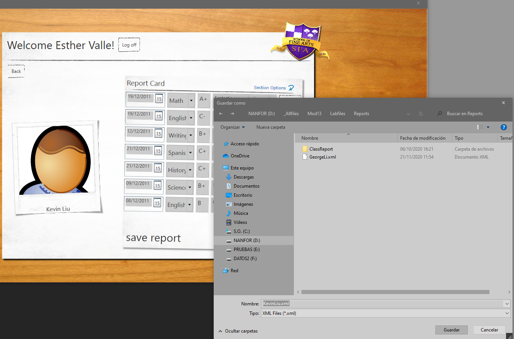
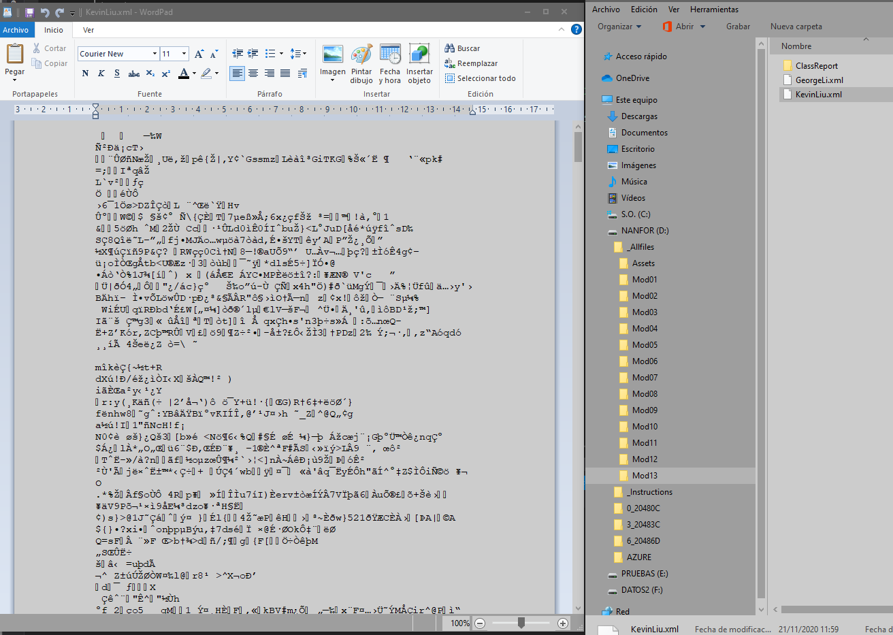
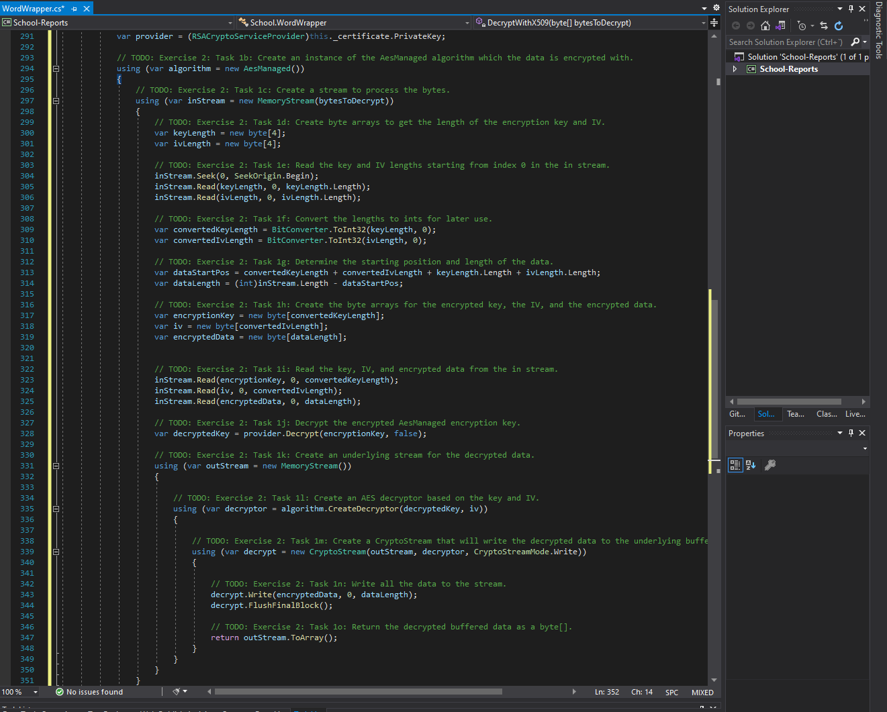
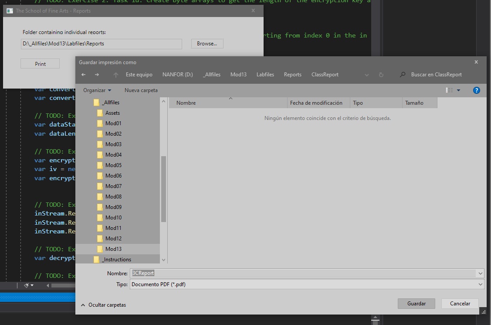
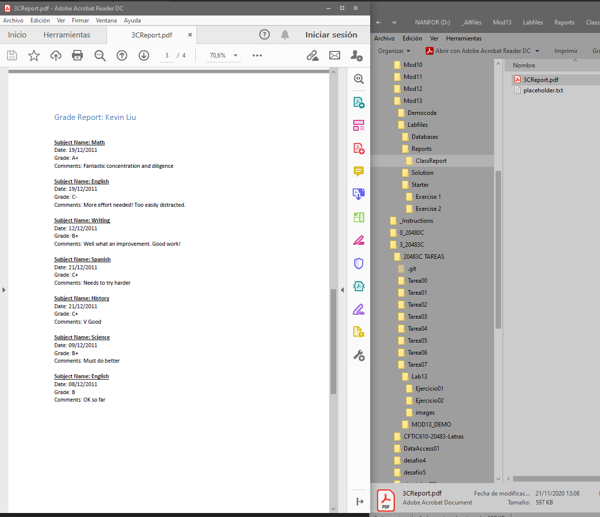

1. Sergio de Vega
2. 21 noviembre 2020
3. **(20483C_MOD13_LAK.md)** Encriptando y desencriptando datos.
   1. **Ejercicio 01:** Encriptando el informe Grades.
      1. Creamos un certificado asimétrico.
      
      2. Obtenemos el certificado Grade.
      3. Encriptamos los datos.
      4. Escribimos los datos encriptados al disco.
      5. Ejecutamos y verificamos.
      
      6. En el navegador web no se muestra el contenido del informe diciéndonos que el documento está vacío.
      [C3](images/C3.PNG)
      7. Y en un editor de texto, vemos el contenido encriptado.
       
      ---
   2. **Ejercicio 02:** .
      1. Desencriptando el informe Grades.
      
      2. Comprobamos los resultados.
      
      
      
 