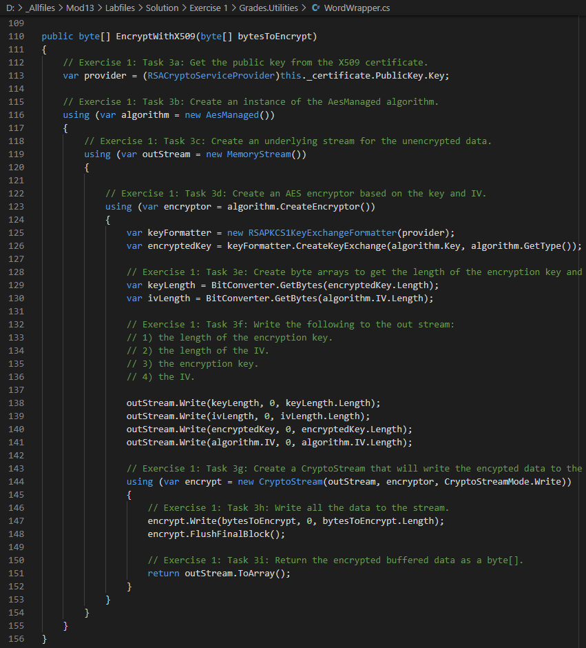
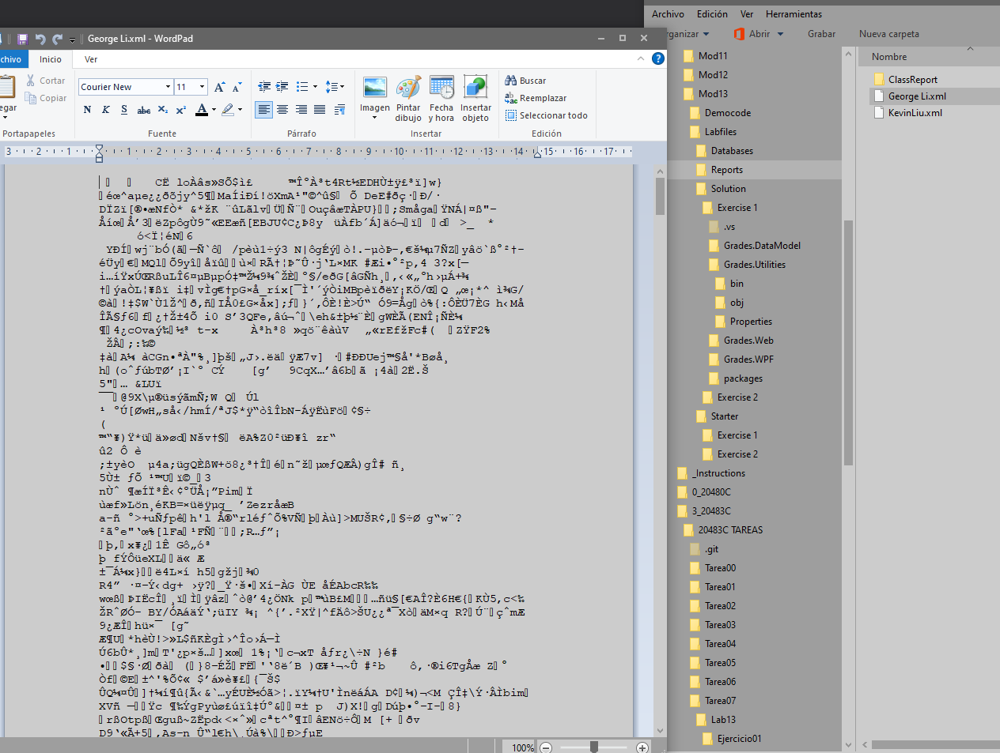
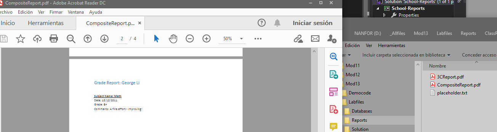

1. Sergio de Vega
2. 21 noviembre 2020
3. **(20483C_MOD13_DEMO.md)** Encriptando y desencriptando datos. 
   1. Lección 2: Implementando encriptación asimétrica.
      1. Creamos un certificado.
      
      
      2. Generamos informes para dos de los estudiantes y vemos desde el notepad su contenido encriptado.
      
      3. Ejecutamos la aplicación School Reports e imprimimos los dos certificados desencriptándolos con el código del método creado al crear el certificado.
      

      