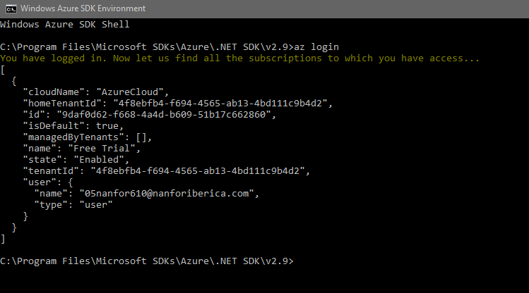
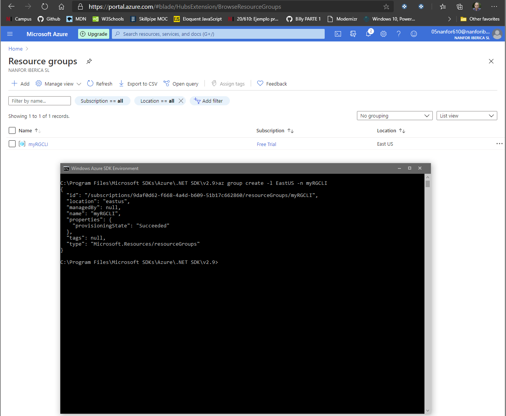
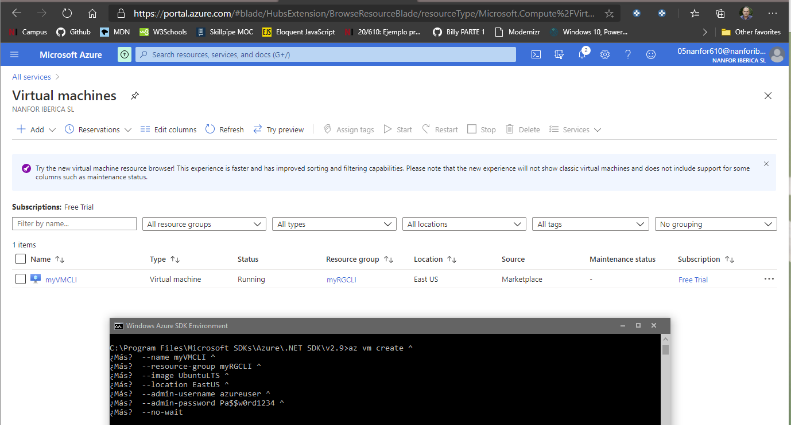
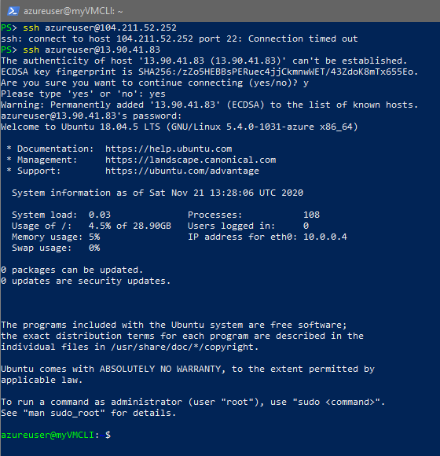
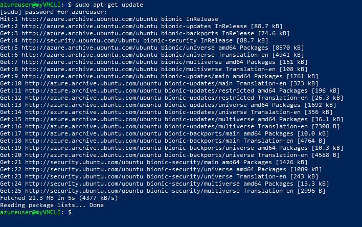
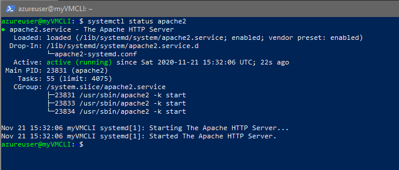
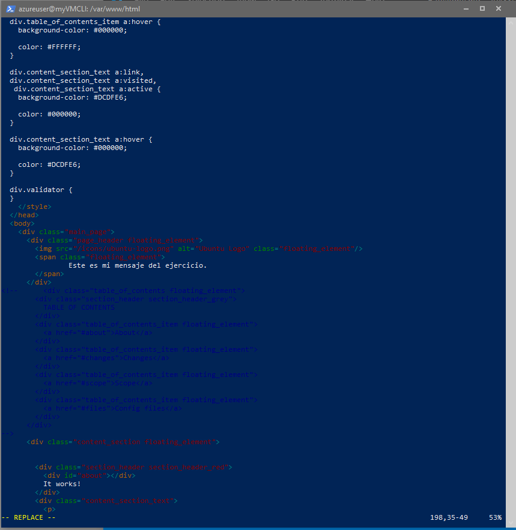
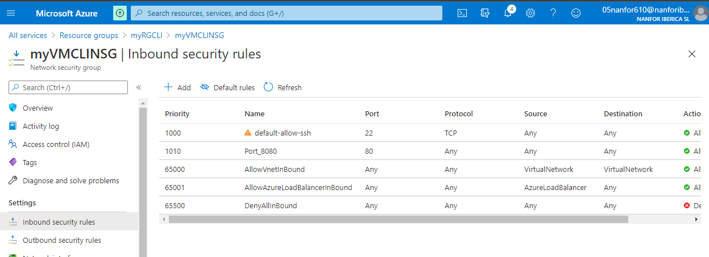
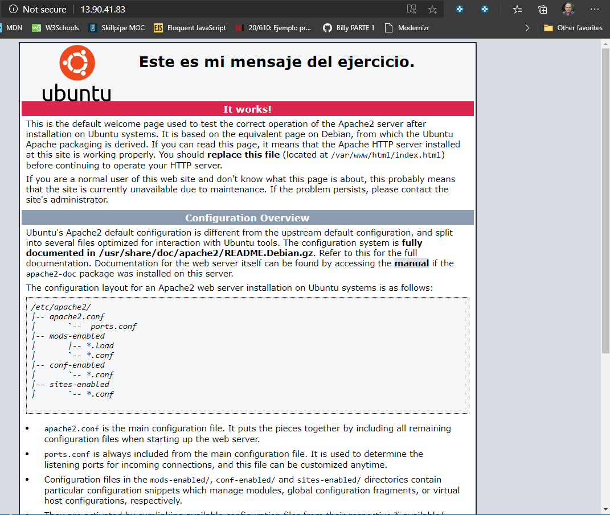
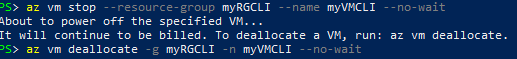

1. Sergio de Vega
2. 21 noviembre 2020
3. **Práctica de Azure fundamentals**
   0. Conectarse desde Azure Cli a Azure, crear un grupo de recursos y una máquina virtual Linux, y conectamos a la VM.
   
   
   
   
   1. Actualizar en Linux.
   
   2. Hacer el upgrade.
   3. Instalar un servidor web.
   4. Vemos el estado de apache2.
   
   5. Ponemos un mensaje en nuestra página de Apache.En index.html
   
   6. Abrimos el puerto 80 para acceder a nuestro servidor y accedemos a él desde el navegador.
   
   
   7. Parar y deallocate la VM.
   
